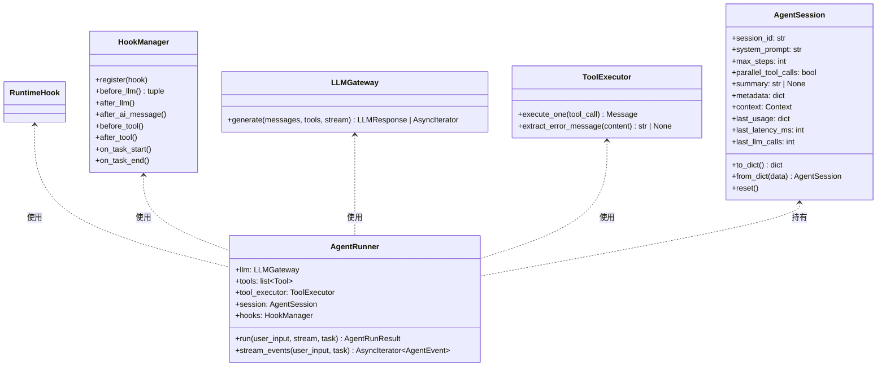
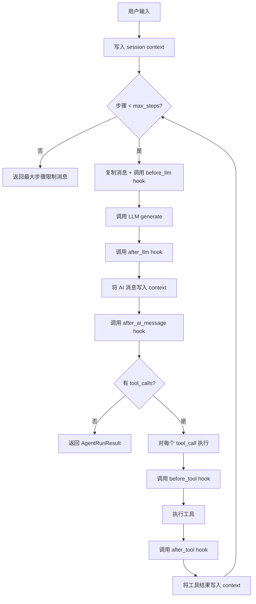

# Agent

`Agent` 是 Wuwei 框架中最核心的执行单元。它负责管理模型调用、工具执行和对话流程。

## 类层次结构



Agent 的运行时核心是 `AgentRunner` 类，它协调 LLM 推理、工具执行和 Hook 生命周期。

## 创建 Agent

### 从环境变量创建（推荐）

`Agent.from_env()` 会自动从环境变量读取模型配置并注册内置工具：

```python
from wuwei import Agent

agent = Agent.from_env()
```

#### 环境变量参数表

| 变量名 | 说明 | 类型 | 默认值 |
|---|---|---|---|
| `WUWEI_MODEL_PROVIDER` | 模型提供商（`openai` / `anthropic`） | `str` | `openai` |
| `WUWEI_MODEL_NAME` | 模型名称 | `str` | `gpt-4o` |
| `WUWEI_API_KEY` | API Key | `str` | **必填** |
| `WUWEI_BASE_URL` | 自定义 API 端点 | `str` | `None` |
| `WUWEI_SYSTEM_PROMPT` | 系统提示词 | `str` | `你是一个有用的助手` |

#### `from_env()` 可选参数

| 参数 | 类型 | 说明 | 默认值 |
|---|---|---|---|
| `session` | `AgentSession` | 传入已有 session 实现会话复用 | 自动创建 |
| `hooks` | `list[RuntimeHook]` | 生命周期钩子列表 | `[]` |
| `tools` | `list[Tool]` | 额外工具（与内置工具合并） | `[]` |

### 手动创建

手动创建可以完全控制模型和工具的配置：

```python
from wuwei import Agent
from wuwei.llm import OpenAILLM
from wuwei.tools import BashTool, FileTool

llm = OpenAILLM(api_key="sk-xxx", model="gpt-4o")

agent = Agent(
    model=llm,
    tools=[BashTool(), FileTool()],
    system_prompt="You are a helpful assistant.",
)
```

!!! tip "提示"
    手动创建时可以完全控制模型和工具的配置，适合测试或特殊场景。

## 运行 Agent

Agent 支持三种运行模式：非流式、流式、事件流。

### 模式一：非流式调用（`run()`）

使用 `run()` 同步等待 Agent 完成整个执行过程，返回 `AgentRunResult`：

```python
result = agent.run("帮我查看当前目录的文件列表")

print(result.content)       # 最终文本内容
print(result.usage)         # token 使用统计
print(result.latency_ms)    # 总耗时（毫秒）
print(result.llm_calls)     # LLM 调用次数
```

#### `AgentRunResult` 字段表

| 字段 | 类型 | 说明 |
|---|---|---|
| `content` | `str` | 最终文本响应内容 |
| `usage` | `dict[str, int]` | Token 使用量，含 `prompt_tokens`、`completion_tokens`、`total_tokens` |
| `latency_ms` | `int` | 总执行耗时（毫秒） |
| `llm_calls` | `int` | LLM 推理调用次数（含多轮工具调用） |

#### 多轮工具调用

当 LLM 返回 `tool_calls` 时，Agent 自动执行工具并将结果反馈给 LLM，循环直到 LLM 返回纯文本或达到 `max_steps` 限制：

```python
# Agent 内部自动处理：LLM -> tool_call -> 执行工具 -> 结果反馈 -> LLM -> ...
result = agent.run("列出 /tmp 下所有 .py 文件并统计行数")
# result.llm_calls 可能 > 1，表示经历了多轮推理
```

#### 完整非流式示例

```python
from wuwei import Agent
from wuwei.agent.session import AgentSession

session = AgentSession(
    session_id="demo-001",
    system_prompt="你是一个 Python 专家。",
    max_steps=15,
    parallel_tool_calls=True,
    metadata={"project": "my-app"},
)

agent = Agent.from_env(session=session)
result = agent.run("分析当前项目的依赖关系")

print(f"内容: {result.content[:200]}...")
print(f"Token: {result.usage['total_tokens']}")
print(f"耗时: {result.latency_ms}ms")
print(f"LLM 调用: {result.llm_calls} 次")
```

### 模式二：流式调用（`stream()`）

使用 `stream()` 异步迭代每个 token chunk，返回 `AsyncIterator[LLMResponseChunk]`：

```python
async for chunk in agent.stream("解释一下量子计算"):
    if chunk.content:
        print(chunk.content, end="", flush=True)
    if chunk.reasoning_content:
        # 推理内容（如 o1/o3 模型的思考过程）
        print(f"[思考] {chunk.reasoning_content}", end="", flush=True)
```

#### `LLMResponseChunk` 字段表

| 字段 | 类型 | 说明 |
|---|---|---|
| `content` | `str` | 文本 token 内容 |
| `reasoning_content` | `str \| None` | 推理/思考内容（部分模型支持） |
| `tool_calls_delta` | `list[dict] \| str \| None` | 工具调用增量 |
| `tool_calls_complete` | `list[ToolCall] \| None` | 完整的工具调用列表（流结束时填充） |
| `finish_reason` | `str \| None` | 结束原因：`stop`、`tool_calls`、`length`、`content_filter` |
| `usage` | `dict[str, int] \| None` | Token 使用量（部分 chunk 携带） |

!!! warning "注意"
    `stream()` 只返回文本和推理 token，**不包含工具调用的结构化信息**。工具调用在后台自动执行，流结束后结果写入 session。如需监控工具执行过程，请使用 `event_stream()`。

### 模式三：事件流调用（`event_stream()`）

使用 `event_stream()` 获取结构化事件，包含完整的执行生命周期：

```python
async for event in agent.event_stream("帮我写一个 Python 脚本"):
    match event.type:
        case "text_delta":
            print(event.data["content"], end="", flush=True)
        case "reasoning_delta":
            print(f"[思考] {event.data['content']}", end="", flush=True)
        case "tool_start":
            print(f"\n>>> 调用工具: {event.data['tool_name']}({event.data['args']})")
        case "tool_end":
            print(f"<<< 工具结果: {event.data['output'][:100]}")
        case "error":
            print(f"[错误] {event.data['message']}")
        case "done":
            print(f"\n--- 完成 (耗时: {event.data['latency_ms']}ms) ---")
```

#### `AgentEvent` 字段表

| 字段 | 类型 | 说明 |
|---|---|---|
| `type` | `str` | 事件类型（见下表） |
| `session_id` | `str` | 会话 ID |
| `step` | `int` | 当前步骤编号（从 0 开始） |
| `data` | `dict[str, Any]` | 事件数据（因类型而异） |

#### 事件类型详解

| type | 说明 | `data` 中的字段 |
|---|---|---|
| `text_delta` | 文本 token 输出 | `content`: 文本片段 |
| `reasoning_delta` | 推理/思考 token | `content`: 推理片段 |
| `tool_start` | 工具开始执行 | `tool_name`, `args`(dict), `tool_call_id` |
| `tool_end` | 工具执行完成 | `tool_name`, `tool_call_id`, `output` |
| `error` | 执行错误 | `message`, `error_type`(可选), `tool_name`(可选), `tool_call_id`(可选) |
| `done` | 执行完成 | `usage`(dict), `latency_ms`(int), `llm_calls`(int) |

!!! info "error 事件"
    `error` 事件有两种来源：
    1. **工具执行错误** — 包含 `tool_name` 和 `tool_call_id`，Agent 继续运行并将错误反馈给 LLM
    2. **全局异常** — 包含 `error_type` 和 `usage`，执行终止

#### 完整事件流示例

```python
import asyncio
from wuwei import Agent

async def main():
    agent = Agent.from_env()
    total_tokens = 0

    async for event in agent.event_stream("帮我执行 ls -la 并解释结果"):
        match event.type:
            case "text_delta":
                print(event.data["content"], end="", flush=True)
            case "tool_start":
                args = event.data["args"]
                print(f"\n>>> {event.data['tool_name']}({args})")
            case "tool_end":
                output = event.data["output"]
                print(f"<<< {output[:200]}")
            case "error":
                print(f"\n!!! 错误: {event.data['message']}")
            case "done":
                usage = event.data["usage"]
                print(f"\n{'='*50}")
                print(f"总 Token: {usage['total_tokens']}")
                print(f"总耗时: {event.data['latency_ms']}ms")
                print(f"LLM 调用: {event.data['llm_calls']} 次")

asyncio.run(main())
```

## Agent 执行循环

Agent 的核心执行循环如下：



## 错误处理

### 最大步骤限制

当 Agent 达到 `max_steps` 限制时，返回一个包含提示信息的结果：

```python
result = agent.run("一个非常复杂的任务")
if "已达到最大步骤限制" in result.content:
    print("任务未能在限制步骤内完成")
    # session 中仍保留了部分执行结果
```

### 工具执行错误

工具执行错误不会终止 Agent，而是作为反馈传递给 LLM 让它自行调整：

```python
# 场景：LLM 尝试读取不存在的文件
# Agent 内部流程：
#   1. LLM 返回 tool_call: read_file("missing.txt")
#   2. 工具返回错误: {"ok": false, "error": {...}}
#   3. 错误结果写入 context
#   4. LLM 看到错误后调整策略（如尝试其他路径）
```

### 人工审批拦截

工具执行前可以通过 `before_tool` hook 抛出 `ToolApprovalRejected` 来拦截：

```python
from wuwei.runtime.hitl import ToolApprovalRejected

# 在自定义 hook 中
async def before_tool(self, session, tool_call, *, step, task=None):
    if tool_call.function.name in ("deploy", "delete_database"):
        raise ToolApprovalRejected("用户拒绝执行危险操作")
```

被拒绝的工具调用会生成一个错误消息写入 context，LLM 会被告知操作被拒绝。

## 并行工具调用

当 `session.parallel_tool_calls = True` 且 LLM 一次返回多个 tool_call 时，工具调用使用 `asyncio.gather` 并行执行：

```python
session = AgentSession(
    session_id="parallel-demo",
    parallel_tool_calls=True,  # 启用并行工具调用
)
agent = Agent.from_env(session=session)

# 如果 LLM 同时返回多个工具调用，它们会并行执行
result = agent.run("同时读取 file1.txt、file2.txt 和 file3.txt 的内容")
```

## 完整示例

```python
import asyncio
from wuwei import Agent
from wuwei.agent.session import AgentSession
from wuwei.runtime.hooks import RuntimeHook
from wuwei.runtime.console_hook import ConsoleHook

class MyHook(RuntimeHook):
    """自定义 hook：记录每次工具调用的耗时"""
    async def before_tool(self, session, tool_call, *, step, task=None):
        import time
        session.metadata["_tool_start"] = time.monotonic()

    async def after_tool(self, session, tool_call, tool_message, *, step, task=None):
        import time
        start = session.metadata.pop("_tool_start", None)
        if start:
            elapsed = time.monotonic() - start
            print(f"[MyHook] {tool_call.function.name} 耗时 {elapsed:.2f}s")

async def main():
    session = AgentSession(
        session_id="full-demo",
        system_prompt="你是一个友好的编程助手。",
        max_steps=20,
        parallel_tool_calls=True,
        metadata={"user_id": "u_12345"},
    )

    agent = Agent.from_env(
        session=session,
        hooks=[ConsoleHook(), MyHook()],
    )

    # 非流式
    result = agent.run("查看 README.md 的内容")
    print(f"\n结果: {result.content[:200]}")

    # 事件流
    async for event in agent.event_stream("帮我创建一个 hello.py 文件"):
        if event.type == "text_delta":
            print(event.data["content"], end="", flush=True)
        elif event.type == "tool_start":
            print(f"\n[工具] {event.data['tool_name']}")

    # 查看统计
    print(f"\n总 Token: {session.last_usage['total_tokens']}")
    print(f"总耗时: {session.last_latency_ms}ms")

asyncio.run(main())
```

## 常见模式

### 模式：多轮对话

```python
agent = Agent.from_env()

agent.run("我叫小明")
agent.run("我在学 Python")
result = agent.run("你还记得我叫什么吗？")
print(result.content)  # "你叫小明。"
# session 自动维护对话历史
```

### 模式：会话持久化

```python
import json

agent = Agent.from_env()
agent.run("帮我分析代码")

# 保存 session
data = agent.session.to_dict()
with open("session.json", "w") as f:
    json.dump(data, f)

# 恢复 session
from wuwei.agent.session import AgentSession
with open("session.json") as f:
    restored = AgentSession.from_dict(json.load(f))
agent2 = Agent.from_env(session=restored)
```

### 模式：Hook 组合

```python
from wuwei.runtime.console_hook import ConsoleHook
from wuwei.runtime.context_hook import ContextCompressionHook
from wuwei.runtime.skill_hook import SkillHook

agent = Agent.from_env(
    hooks=[
        ConsoleHook(),                    # 调试日志
        ContextCompressionHook(...),      # 上下文压缩
        SkillHook(),                      # 技能加载
    ]
)
```
