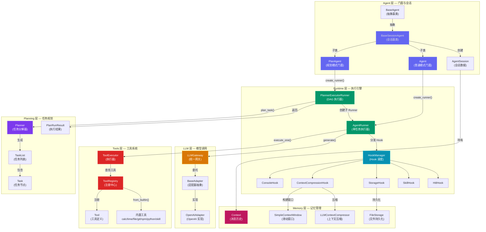
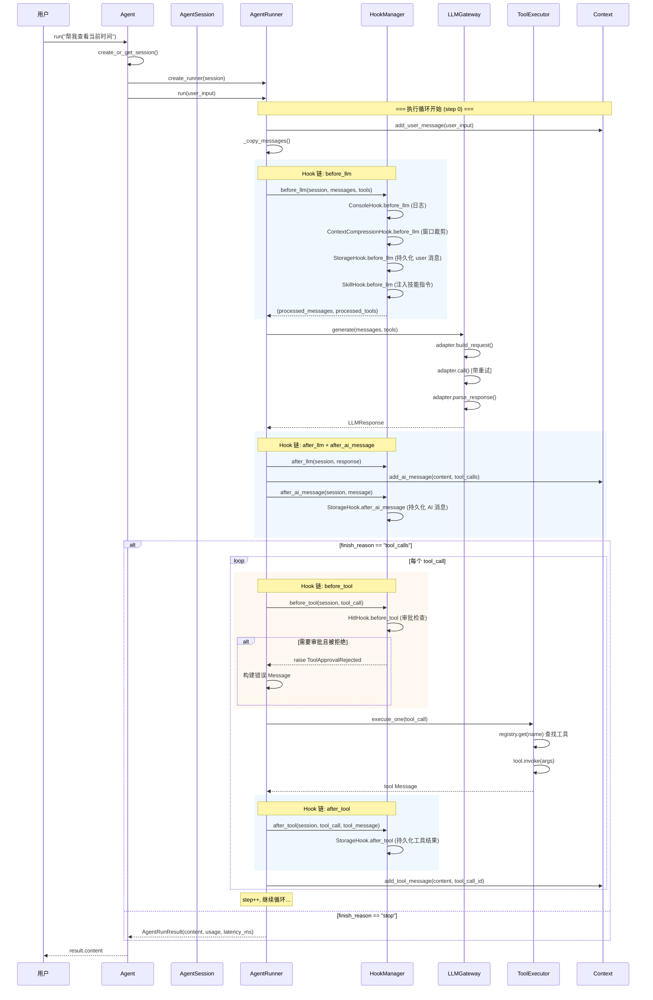
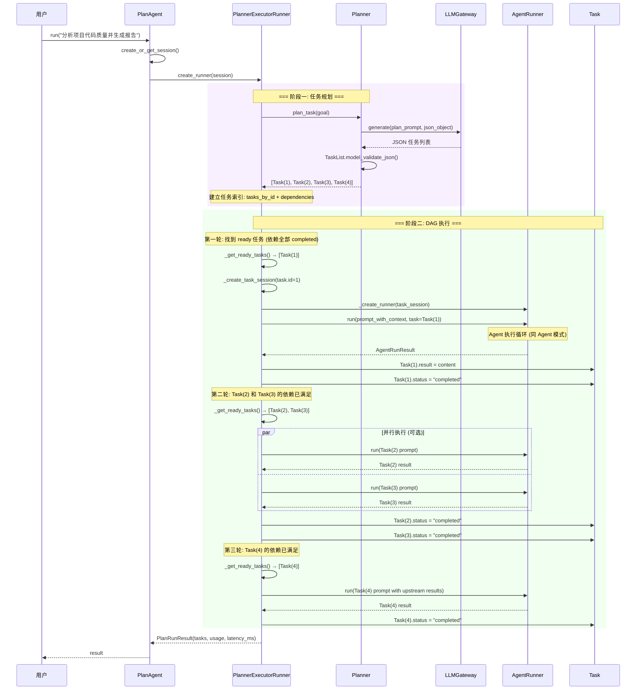
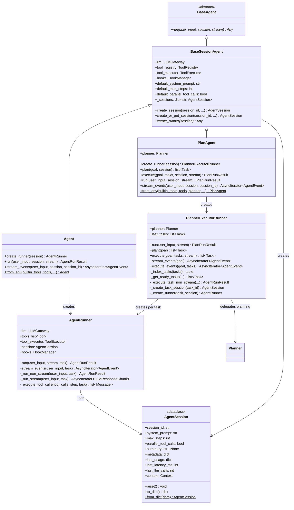

# 架构总览

Wuwei 是一个面向 Agent 应用开发的 Python 框架，采用**分层解耦架构**设计。整个系统由六个核心层次组成：Agent 层负责门面抽象与会话管理，Runtime 层负责执行引擎与 Hook 编排，LLM 层提供统一的模型调用接口，Tools 层实现工具注册与执行，Memory 层管理消息上下文与持久化，Planning 层负责复杂目标的任务分解。每一层只依赖下层接口，不进行跨层调用，从而实现了清晰的职责边界和高度的可替换性。

框架提供了两种运行模式：**Agent 模式**适用于简单的对话-工具循环场景，由 `AgentRunner` 驱动 LLM 调用与工具执行的闭环；**PlanAgent 模式**适用于复杂任务，由 `Planner` 将目标分解为 DAG 任务图，再由 `PlannerExecutorRunner` 按依赖顺序调度 `AgentRunner` 逐个执行子任务。两种模式共享同一套 Hook 系统、工具系统和记忆系统，确保行为一致性。

!!! tip "快速上手"
    如果你是第一次接触 Wuwei，建议先看下方的 **整体架构图** 了解全貌，然后通过 **Agent 模式时序图** 理解核心执行循环，最后查阅 **模块职责表** 定位你需要深入了解的组件。

---

## 整体架构

下图展示了 Wuwei 框架的完整模块关系。六个子图分别对应六个架构层次，箭头表示依赖或调用方向。



---

## 模块职责

| 模块 | 包路径 | 核心文件 | 职责 | 关键类 |
|---|---|---|---|---|
| **Agent** | `wuwei.agent` | `base.py`, `agent.py`, `plan_agent.py`, `session.py` | 门面对象，提供 `run()` / `stream_events()` / `from_env()` 入口；管理会话生命周期 | `BaseAgent`, `BaseSessionAgent`, `Agent`, `PlanAgent`, `AgentSession` |
| **Runtime** | `wuwei.runtime` | `agent_runner.py`, `planner_executor_runner.py`, `hooks.py`, `hitl.py` + 4 个 Hook 实现 | 执行引擎，编排 Hook → LLM → Tool 循环；提供 HITL 审批能力 | `AgentRunner`, `PlannerExecutorRunner`, `HookManager`, `RuntimeHook`, `HitlHook` |
| **LLM** | `wuwei.llm` | `gateway.py`, `types.py`, `adapters/base.py`, `adapters/openai.py` | 统一模型调用，支持流式/非流式生成，自动重试与超时 | `LLMGateway`, `BaseAdapter`, `OpenAIAdapter`, `Message`, `LLMResponse`, `AgentEvent` |
| **Tools** | `wuwei.tools` | `tool.py`, `registry.py`, `executor.py`, `builtin/` | 工具定义、注册、schema 自动生成、执行与错误处理 | `Tool`, `ToolParameters`, `ToolRegistry`, `ToolExecutor` |
| **Memory** | `wuwei.memory` | `context.py`, `context_window.py`, `context_compressor.py`, `storage.py` | 消息上下文维护、滑动窗口裁剪、LLM 压缩、文件持久化 | `Context`, `SimpleContextWindow`, `LLMContextCompressor`, `FileStorage` |
| **Planning** | `wuwei.planning` | `planner.py`, `task.py` | 将复杂目标分解为 DAG 任务图；定义任务状态机 | `Planner`, `Task`, `TaskList`, `PlanRunResult` |
| **Skill** | `wuwei.skill` | `skill.py`, `fs_provider.py` | 可复用能力包，支持从文件系统加载技能指令与脚本 | `Skill`, `SkillProvider`, `SkillManager` |

---

## 目录结构

```text
wuwei/
├── __init__.py                     # 包入口，导出顶层 API
├── agent/                          # Agent 层 — 门面与会话
│   ├── __init__.py
│   ├── base.py                     # BaseAgent (抽象基类) + BaseSessionAgent (会话基类)
│   │                               #   BaseAgent: 定义 run() 抽象方法
│   │                               #   BaseSessionAgent: 收敛 llm/tools/hooks 初始化，
│   │                               #   提供 create_session() / create_or_get_session()
│   ├── agent.py                    # Agent 门面 — 普通单 Agent 模式
│   │                               #   create_runner() → AgentRunner
│   │                               #   run() / stream_events() / from_env()
│   ├── plan_agent.py               # PlanAgent 门面 — Plan-and-Execute 模式
│   │                               #   create_runner() → PlannerExecutorRunner
│   │                               #   plan() / execute() / run() / stream_events()
│   └── session.py                  # AgentSession 数据类
│                                   #   持有 session_id, system_prompt, max_steps,
│                                   #   Context, usage 统计, metadata
│
├── runtime/                        # Runtime 层 — 执行引擎
│   ├── __init__.py
│   ├── agent_runner.py             # AgentRunner — 单任务执行器
│   │                               #   核心循环: before_llm → LLM → after_llm →
│   │                               #   before_tool → execute → after_tool → 循环
│   │                               #   支持 run() / stream_events() 三种输出模式
│   ├── planner_executor_runner.py  # PlannerExecutorRunner — DAG 执行器
│   │                               #   plan() → 构建任务索引 → 按依赖拓扑执行
│   │                               #   为每个 Task 创建隔离 AgentSession + AgentRunner
│   ├── hooks.py                    # RuntimeHook (基类) + HookManager (调度器)
│   │                               #   7 个 Hook 点: before_llm, after_llm,
│   │                               #   after_ai_message, before_tool, after_tool,
│   │                               #   on_task_start, on_task_end
│   ├── console_hook.py             # ConsoleHook — 调试日志输出
│   ├── context_hook.py             # ContextCompressionHook — 滑动窗口 + 滚动摘要
│   ├── storage_hook.py             # StorageHook — 消息增量持久化
│   ├── skill_hook.py               # SkillHook — 注入 Skill 使用指令到 system prompt
│   ├── hitl.py                     # HITL 审批框架
│   │                               #   ApprovalRequest / ApprovalDecision / ApprovalPolicy
│   │                               #   ApprovalProvider (Protocol) / ConsoleApprovalProvider
│   └── hitl_hook.py                # HitlHook — 在 before_tool 中拦截需审批的工具调用
│
├── llm/                            # LLM 层 — 模型调用
│   ├── __init__.py                 # 导出公共类型
│   ├── gateway.py                  # LLMGateway — 统一网关
│   │                               #   from_env() 自动查找 .env 文件
│   │                               #   generate() 支持流式/非流式
│   │                               #   内置指数退避重试
│   ├── types.py                    # 核心数据类型 (全部基于 Pydantic)
│   │                               #   Message, ToolCall, FunctionCall,
│   │                               #   LLMResponse, LLMResponseChunk,
│   │                               #   AgentEvent, AgentRunResult
│   └── adapters/
│       ├── __init__.py
│       ├── base.py                 # BaseAdapter — 适配器抽象 (ABC)
│       │                           #   build_request / call / parse_response / parse_stream_chunk
│       └── openai.py               # OpenAIAdapter — OpenAI 兼容协议实现
│                                   #   支持 base_url 自定义端点
│
├── tools/                          # Tools 层 — 工具系统
│   ├── __init__.py                 # 导出 Tool, ToolRegistry, ToolExecutor
│   ├── tool.py                     # Tool + ToolParameters — 工具定义
│   │                               #   to_schema() 生成 OpenAI function calling 格式
│   │                               #   invoke() 支持 sync/async handler
│   ├── registry.py                 # ToolRegistry — 注册中心
│   │                               #   register() / register_callable() / @tool 装饰器
│   │                               #   from_builtin() 加载内置工具
│   │                               #   自动从函数签名生成 JSON Schema
│   ├── executor.py                 # ToolExecutor — 执行器
│   │                               #   execute_one() 查找工具 → invoke → 序列化输出
│   │                               #   错误统一包装为 {ok: false, error: {...}}
│   └── builtin/                    # 内置工具集
│       ├── __init__.py             # BUILTIN_TOOL_REGISTRARS 注册表
│       ├── calc_tools.py           # 计算器工具
│       ├── time_tools.py           # 时间工具
│       ├── file_tools.py           # 文件读写工具
│       ├── git_tools.py            # Git 操作工具
│       ├── npm_tools.py            # npm/node 工具
│       ├── python_tools.py         # Python 执行工具
│       └── skill_tools.py          # 技能加载工具
│
├── memory/                         # Memory 层 — 记忆管理
│   ├── __init__.py
│   ├── context.py                  # Context — 消息历史管理
│   │                               #   add_user/system/ai/tool_message
│   │                               #   keep_last_turns() 滑动窗口
│   │                               #   to_dict() / from_dict() 序列化
│   ├── context_window.py           # SimpleContextWindow — 上下文窗口构建器
│   │                               #   build_messages() 组装 system + summary + recent
│   │                               #   truncate_tool_message() 裁剪过长工具输出
│   │                               #   split_turns() 按轮次切分消息
│   ├── context_compressor.py       # ContextCompressor (Protocol) + LLMContextCompressor
│   │                               #   compress() 将旧对话压缩为结构化摘要
│   │                               #   保留: 用户目标、已确认事实、工具结果、待办事项
│   └── storage.py                  # Storage (Protocol) + FileStorage
│                                   #   meta.json 存元数据，.jsonl 逐条追加消息
│                                   #   支持 load / delete / save_meta / append_message
│
├── planning/                       # Planning 层 — 任务规划
│   ├── __init__.py                 # 导出 Planner, Task, TaskList, PlanRunResult
│   ├── planner.py                  # Planner — 任务分解器
│   │                               #   plan_task() 调用 LLM 生成 DAG 任务图
│   │                               #   内置 10 条规划规则约束输出格式
│   └── task.py                     # Task / TaskList / PlanRunResult
│                                   #   Task: id, description, next, status, result, error
│                                   #   状态机: pending → in_progress → completed/failed/blocked
│
└── skill/                          # Skill 层 — 技能系统
    ├── __init__.py
    ├── skill.py                    # Skill (数据类) + SkillProvider (Protocol) + SkillManager
    │                               #   管理技能的索引、查询、指令加载
    └── fs_provider.py              # FileSystemSkillProvider — 从目录加载技能
                                    #   扫描 Markdown 文件作为技能指令
                                    #   支持 scripts/ 子目录存放 Python 脚本
```

---

## 执行流程

### Agent 模式 — 完整时序图

Agent 模式是最基本的运行模式，适用于单轮或多轮对话场景。核心循环为：用户输入 → Hook 处理 → LLM 生成 → 工具调用（可选） → 回写上下文 → 循环直到 LLM 返回最终回答。



### PlanAgent 模式 — DAG 执行时序图

PlanAgent 模式适用于复杂任务。首先由 Planner 将目标分解为 DAG 任务图，然后 PlannerExecutorRunner 按拓扑顺序调度执行，每个子任务创建独立的 AgentSession 和 AgentRunner。



---

## 类继承关系

下图展示了 Agent 层的类继承体系。`BaseAgent` 定义了最小抽象接口，`BaseSessionAgent` 收敛了公共初始化逻辑，`Agent` 和 `PlanAgent` 分别实现两种运行模式。



---

## 数据流 — Message 的生命周期

下图展示了 `Message` 对象从用户输入到最终响应的完整流转路径。理解这条数据流是掌握框架的关键。

```mermaid
graph LR
    subgraph "1. 用户输入"
        UI["用户文本<br/>run('帮我查天气')"]
    end

    subgraph "2. Context 写入"
        UMSG["Message(role='user')<br/>context.add_user_message()"]
    end

    subgraph "3. Hook 处理"
        BL["before_llm hooks<br/>窗口裁剪 / 技能注入<br/>持久化 user 消息"]
    end

    subgraph "4. LLM 生成"
        GEN["LLMGateway.generate()<br/>adapter.build_request()<br/>adapter.call()"]
        RESP["LLMResponse<br/>message: Message<br/>finish_reason: stop|tool_calls"]
    end

    subgraph "5. 结果分类"
        DECIDE{"finish_reason?"}
    end

    subgraph "6a. 工具调用路径"
        TC["ToolCall<br/>function.name + arguments"]
        BT["before_tool hooks<br/>HITL 审批"]
        EXEC["ToolExecutor.execute_one()<br/>tool.invoke(args)"]
        AT["after_tool hooks<br/>持久化工具结果"]
        TMSG["Message(role='tool')<br/>context.add_tool_message()"]
    end

    subgraph "6b. 最终回答路径"
        AMSG["Message(role='assistant')<br/>context.add_ai_message()"]
        AL["after_llm + after_ai_message hooks<br/>持久化 AI 消息"]
        RESULT["AgentRunResult<br/>content + usage + latency_ms"]
    end

    subgraph "7. 流式输出 (可选)"
        CHUNK["LLMResponseChunk<br/>content + reasoning_content"]
        EVENT["AgentEvent<br/>text_delta / tool_start / tool_end / done"]
    end

    UI --> UMSG
    UMSG --> BL
    BL --> GEN
    GEN --> RESP
    RESP --> DECIDE
    DECIDE -->|"tool_calls"| TC
    TC --> BT
    BT --> EXEC
    EXEC --> AT
    AT --> TMSG
    TMSG -->|"回写 Context, 继续循环"| BL
    DECIDE -->|"stop"| AMSG
    AMSG --> AL
    AL --> RESULT
    GEN -.->|"stream=True"| CHUNK
    CHUNK -.-> EVENT

    style UI fill:#6366f1,stroke:#818cf8,color:#fff
    style RESULT fill:#059669,stroke:#34d399,color:#fff
    style EVENT fill:#059669,stroke:#34d399,color:#fff
```



!!! info "Message 的角色"
    框架中 `Message` 有四种角色：`system`（系统指令）、`user`（用户输入）、`assistant`（模型回复，可包含 `tool_calls`）、`tool`（工具执行结果，通过 `tool_call_id` 关联）。这四种角色的消息在 `Context` 中按时间顺序维护，构成完整的对话历史。

---

## Hook 系统详解

Hook 系统是 Wuwei 的核心扩展机制。`HookManager` 持有一组 `RuntimeHook` 实例，在执行循环的关键节点依次调用。每个 Hook 点都有明确的输入输出契约：

| Hook 点 | 触发时机 | 输入 | 可修改内容 |
|---|---|---|---|
| `before_llm` | LLM 调用前 | session, messages, tools, step | messages (裁剪/注入), tools (动态增减) |
| `after_llm` | LLM 响应后 | session, response, step | — (只读观察) |
| `after_ai_message` | AI 消息写入 Context 后 | session, message, step | — (只读观察) |
| `before_tool` | 工具执行前 | session, tool_call, step | — (可抛异常拦截) |
| `after_tool` | 工具执行后 | session, tool_call, tool_message, step | — (只读观察) |
| `on_task_start` | 子任务开始 (PlanAgent) | session, task | — (只读观察) |
| `on_task_end` | 子任务结束 (PlanAgent) | session, task | — (只读观察) |

**内置 Hook 实现：**

- **ConsoleHook** — 调试日志，打印 LLM 调用和工具执行的详细信息
- **ContextCompressionHook** — 当对话轮次超过阈值时，自动压缩旧消息为摘要，构建滑动窗口
- **StorageHook** — 每条消息即时追加到文件存储，实现会话持久化
- **SkillHook** — 将 Skill 使用指令注入 system prompt，引导模型合理使用技能系统
- **HitlHook** — 在工具执行前检查审批策略，支持人工审批拦截

---

## 设计原则

### 1. 模块边界清晰，依赖单向流动

Wuwei 的六层架构严格遵循自上而下的依赖关系：Agent 层依赖 Runtime 层，Runtime 层依赖 LLM 层和 Tools 层，Memory 层被 Runtime 层通过 Hook 机制间接使用。没有任何一层直接引用其上层的实现。这种设计使得每一层都可以独立测试和替换——例如，你可以用一个新的 `Storage` 实现替换 `FileStorage`，而不需要修改 Agent 或 Runtime 层的任何代码。层间通信完全通过接口（Protocol 或 ABC）进行，而非具体实现类。

### 2. Hook 优先扩展，核心保持稳定

框架的可扩展性主要通过 Hook 系统实现，而非修改核心代码。新增功能（如日志、持久化、上下文压缩、人工审批）都以 `RuntimeHook` 子类的形式存在，通过 `HookManager` 注册即可生效。Hook 链式调用的顺序即为注册顺序，每个 Hook 都可以独立启用或禁用。这意味着框架的核心执行循环（AgentRunner 的 while loop）自项目建立以来几乎不需要修改，所有新功能都通过 Hook 挂载。

### 3. 协议优于实现，面向接口编程

框架大量使用 Python 的 `Protocol` 和 `ABC` 来定义接口。`Storage`、`ContextCompressor`、`ApprovalProvider`、`SkillProvider` 都是 Protocol，`BaseAdapter` 是 ABC。这使得用户可以提供自己的实现而不依赖框架的默认实现。例如，你可以实现一个 `DatabaseStorage` 替换 `FileStorage`，或者实现一个 `WebApprovalProvider` 替换 `ConsoleApprovalProvider`，只要满足 Protocol 定义的方法签名即可。

### 4. 框架不绑定业务，保持最小假设

Wuwei 不假设任何特定的业务场景。它不知道 `user_id` 是什么，不假设数据库类型，不绑定审批方式，不指定日志目标。所有这些都通过 Hook 和 Protocol 由应用层自行决定。框架内部只关心三件事：如何调用 LLM、如何执行工具、如何维护对话历史。这种最小假设的设计使得同一个框架既可以用于构建命令行助手，也可以用于构建 Web API 服务或 IM 机器人。

### 5. 渐进式复杂度，简单场景简单用

框架提供了 `from_env()` 类方法，用一行代码即可创建可用的 Agent。对于简单场景，你只需要 `Agent.from_env(builtin_tools=["time", "calc"])` 就能获得一个功能完整的助手。随着需求增长，你可以逐步添加自定义工具、Hook、持久化存储、上下文压缩、人工审批等能力。PlanAgent 模式也是按需引入的——只有当任务复杂到需要分解和规划时才使用。这种渐进式设计降低了学习曲线，让开发者可以在需要时才引入复杂度。

---

## 核心类型一览

所有核心数据类型均基于 Pydantic `BaseModel`，支持序列化、验证和类型安全：

| 类型 | 包路径 | 用途 |
|---|---|---|
| `Message` | `wuwei.llm.types` | 对话消息，包含 role / content / tool_calls / reasoning_content |
| `ToolCall` | `wuwei.llm.types` | 工具调用请求，包含 id / type / function |
| `FunctionCall` | `wuwei.llm.types` | 函数调用详情，包含 name / arguments |
| `LLMResponse` | `wuwei.llm.types` | LLM 非流式响应，包含 message / finish_reason / usage / latency_ms |
| `LLMResponseChunk` | `wuwei.llm.types` | LLM 流式响应块，支持 tool_calls 增量拼接 |
| `AgentEvent` | `wuwei.llm.types` | 结构化事件流，类型包括 text_delta / reasoning_delta / tool_start / tool_end / done / error |
| `AgentRunResult` | `wuwei.llm.types` | Agent 单次运行结果，包含 content / usage / latency_ms / llm_calls |
| `Tool` | `wuwei.tools.tool` | 工具定义，包含 name / description / parameters / handler |
| `Task` | `wuwei.planning.task` | 任务节点，包含 id / description / next / status / result / error |
| `TaskList` | `wuwei.planning.task` | 任务列表包装，用于 Planner 输出解析 |
| `PlanRunResult` | `wuwei.planning.task` | PlanAgent 运行结果，包含规划和执行两个阶段的统计 |
| `AgentSession` | `wuwei.agent.session` | 会话数据，持有配置、Context、usage 统计和 metadata |
| `Skill` | `wuwei.skill.skill` | 技能元数据，包含 name / description / instruction / path |
