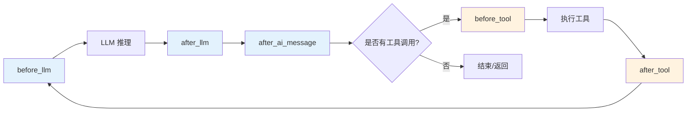

# Hook 系统

Hook（钩子）是 Wuwei Agent 的核心扩展机制。通过 Hook，你可以在 Agent 生命周期的各个阶段插入自定义逻辑，实现日志记录、上下文压缩、人在回路审批、技能加载等功能。

## 生命周期概览



### 触发阶段总览

| 阶段 | 触发时机 | 参数 | 可修改内容 | 常见用途 |
|---|---|---|---|---|
| `before_llm` | LLM 推理之前 | session, messages, tools, step, task | 返回修改后的 messages 和 tools | 注入上下文、修改消息、添加工具约束 |
| `after_llm` | LLM 推理之后 | session, response, step, task | 无（仅观察） | 日志记录、响应分析 |
| `after_ai_message` | AI 消息写入 context 之后 | session, message, step, task | 无（仅观察） | 记录日志、Token 计数、审计 |
| `before_tool` | 工具执行之前 | session, tool_call, step, task | 抛出 `ToolApprovalRejected` 可阻止执行 | 参数校验、审批拦截 |
| `after_tool` | 工具执行之后 | session, tool_call, tool_message, step, task | 无（仅观察） | 结果后处理、审计 |
| `on_task_start` | PlanAgent 子任务开始前 | session, task | 无（仅观察） | 任务进度追踪 |
| `on_task_end` | PlanAgent 子任务结束后 | session, task | 无（仅观察） | 任务结果记录 |

## RuntimeHook 接口

所有 Hook 都需要继承 `RuntimeHook` 基类。该基类定义了生命周期中的各个回调方法，所有方法都有默认空实现，你只需重写关心的方法：

```python
from wuwei.runtime.hooks import RuntimeHook
from wuwei.agent.session import AgentSession
from wuwei.llm import Message, LLMResponse, ToolCall

class RuntimeHook:
    """Hook 基类，所有回调方法均为可选重写。"""

    async def before_llm(
        self,
        session: AgentSession,
        messages: list[Message],
        tools: list[Tool],
        *,
        step: int,
        task: Task | None = None,
    ) -> tuple[list[Message], list[Tool]]:
        """LLM 推理前调用。返回 (messages, tools) 供后续使用。"""
        return messages, tools

    async def after_llm(
        self,
        session: AgentSession,
        response: LLMResponse,
        *,
        step: int,
        task: Task | None = None,
    ) -> None:
        """LLM 推理后调用。仅观察，无返回值。"""
        pass

    async def after_ai_message(
        self,
        session: AgentSession,
        message: Message,
        *,
        step: int,
        task: Task | None = None,
    ) -> None:
        """AI 消息写入 context 后调用。"""
        pass

    async def before_tool(
        self,
        session: AgentSession,
        tool_call: ToolCall,
        *,
        step: int,
        task: Task | None = None,
    ) -> None:
        """工具执行前调用。抛出 ToolApprovalRejected 可阻止执行。"""
        pass

    async def after_tool(
        self,
        session: AgentSession,
        tool_call: ToolCall,
        tool_message: Message,
        *,
        step: int,
        task: Task | None = None,
    ) -> None:
        """工具执行后调用。"""
        pass

    async def on_task_start(
        self,
        session: AgentSession,
        task: Task,
    ) -> None:
        """PlanAgent 子任务开始前调用。"""
        pass

    async def on_task_end(
        self,
        session: AgentSession,
        task: Task,
    ) -> None:
        """PlanAgent 子任务结束后调用。"""
        pass
```

### 各回调方法详解

#### `before_llm` — LLM 推理前

```python
async def before_llm(self, session, messages, tools, *, step, task=None):
    # messages: 当前消息列表的深拷贝
    # tools: 当前可用工具列表
    # step: 当前步骤编号（从 0 开始）
    # task: PlanAgent 中的当前子任务（普通 Agent 为 None）

    # 必须返回 (messages, tools)
    return messages, tools
```

!!! info "可修改性"
    `before_llm` 是唯一可以修改消息和工具列表的 hook。返回的 messages 和 tools 会传递给下一个 hook 和最终的 LLM 调用。

#### `after_llm` — LLM 推理后

```python
async def after_llm(self, session, response, *, step, task=None):
    # response: LLMResponse 对象
    #   response.message: Message (AI 消息)
    #   response.finish_reason: "stop" | "tool_calls" | "length" | "content_filter"
    #   response.usage: dict (token 使用量)
    #   response.model: str (模型名称)
    #   response.latency_ms: int (推理耗时)
    pass
```

#### `after_ai_message` — AI 消息写入后

```python
async def after_ai_message(self, session, message, *, step, task=None):
    # message: 已写入 context 的 AI 消息
    #   message.content: str (文本内容)
    #   message.tool_calls: list[ToolCall] | None
    #   message.reasoning_content: str | None (推理内容)
    pass
```

#### `before_tool` — 工具执行前

```python
async def before_tool(self, session, tool_call, *, step, task=None):
    # tool_call: ToolCall 对象
    #   tool_call.id: str (调用 ID)
    #   tool_call.function.name: str (工具名称)
    #   tool_call.function.arguments: dict (工具参数)

    # 抛出 ToolApprovalRejected 可阻止工具执行
    from wuwei.runtime.hitl import ToolApprovalRejected
    if tool_call.function.name == "dangerous_tool":
        raise ToolApprovalRejected("操作被拒绝")
```

#### `after_tool` — 工具执行后

```python
async def after_tool(self, session, tool_call, tool_message, *, step, task=None):
    # tool_call: ToolCall 对象（同 before_tool）
    # tool_message: Message 对象（工具执行结果）
    #   tool_message.content: str (结果内容，通常为 JSON)
    #   tool_message.tool_call_id: str
    pass
```

#### `on_task_start` / `on_task_end` — 任务生命周期

```python
async def on_task_start(self, session, task):
    # task: Task 对象
    #   task.id: int
    #   task.description: str
    #   task.status: "in_progress"（调用时）
    pass

async def on_task_end(self, session, task):
    # task.status: "completed" | "failed" | "blocked"
    # task.result: str | None（成功时）
    # task.error: str | None（失败时）
    pass
```

## HookManager

`HookManager` 负责管理和执行多个 Hook。它按注册顺序依次调用每个 Hook 的回调方法：

```python
from wuwei.runtime.hooks import HookManager

manager = HookManager()

# 注册 Hook
manager.register(ConsoleHook())
manager.register(MyCustomHook())

# 也可以在构造时传入
manager = HookManager(hooks=[ConsoleHook(), MyCustomHook()])
```

### HookManager 的执行逻辑

```python
# before_llm：管道式传递，前一个 hook 的输出是后一个的输入
async def before_llm(self, session, messages, tools, *, step, task=None):
    current_messages = messages
    current_tools = tools
    for hook in self._hooks:
        current_messages, current_tools = await hook.before_llm(
            session, current_messages, current_tools, step=step, task=task
        )
    return current_messages, current_tools

# 其他回调：依次调用，无管道传递
async def after_llm(self, session, response, *, step, task=None):
    for hook in self._hooks:
        await hook.after_llm(session, response, step=step, task=task)
```

## 内置 Hooks

Wuwei 提供了 4 个开箱即用的 Hook 实现。

### 1. ConsoleHook

**用途**：在控制台输出 Agent 生命周期事件，适合开发调试。

**文件位置**：`wuwei/runtime/console_hook.py`

**触发时机**：`after_llm`、`before_tool`、`after_tool`、`on_task_start`、`on_task_end`

```python
from wuwei.runtime.console_hook import ConsoleHook

agent = Agent.from_env(hooks=[ConsoleHook()])
result = agent.run("查看当前目录")
```

输出示例：
```
[llm] session=demo-001 step=0 finish_reason=tool_calls
[tool.start] session=demo-001 step=0 name=bash args={"command": "ls -la"}
[tool.end] session=demo-001 step=0 name=bash result={"ok": true, "output": "..."}
[llm] session=demo-001 step=1 finish_reason=stop
```

### 2. ContextCompressionHook

**用途**：当对话历史超过阈值时自动压缩旧消息为摘要，防止 context window 溢出。

**文件位置**：`wuwei/runtime/context_hook.py`

**触发时机**：`before_llm`（检查并压缩）

| 参数 | 类型 | 说明 | 默认值 |
|---|---|---|---|
| `compressor` | `ContextCompressor` | 压缩器实例 | **必填** |
| `context_window` | `SimpleContextWindow` | 上下文窗口管理器 | 自动创建 |
| `compress_after_turns` | `int` | 超过多少轮后触发压缩 | `30` |
| `keep_recent_turns` | `int` | 保留最近多少轮不压缩 | `10` |

```python
from wuwei.runtime.context_hook import ContextCompressionHook
from wuwei.memory.context_compressor import ContextCompressor
from wuwei.memory.context_window import SimpleContextWindow, ContextWindowConfig

hook = ContextCompressionHook(
    compressor=ContextCompressor(llm=my_llm),
    compress_after_turns=30,
    keep_recent_turns=10,
)

agent = Agent.from_env(hooks=[hook])
```

!!! warning "注意"
    `keep_recent_turns` 必须小于 `compress_after_turns`，否则会抛出 `ValueError`。

### 3. HitlHook（人在回路审批）

**用途**：在敏感工具执行前暂停并请求人工确认。

**文件位置**：`wuwei/runtime/hitl.py`

**触发时机**：`before_tool`（通过 `ToolApprovalRejected` 拦截）

#### 核心组件

| 类 | 说明 |
|---|---|
| `ApprovalPolicy` | 审批策略，根据工具名决定是否需要审批 |
| `ApprovalProvider` | 审批提供者协议（可自定义实现） |
| `ConsoleApprovalProvider` | 控制台审批提供者（开发用） |
| `ToolApprovalRejected` | 拒绝异常（抛出后阻止工具执行） |

```python
from wuwei.runtime.hitl import (
    ApprovalPolicy,
    ConsoleApprovalProvider,
    ToolApprovalRejected,
)
from wuwei.runtime.hooks import RuntimeHook

class HitlHook(RuntimeHook):
    """人在回路审批 Hook"""

    def __init__(self, policy: ApprovalPolicy, provider):
        self.policy = policy
        self.provider = provider

    async def before_tool(self, session, tool_call, *, step, task=None):
        if self.policy.requires_tool_approval(tool_call, session=session, task=task):
            from wuwei.runtime.hitl import ApprovalRequest
            request = ApprovalRequest(
                id=f"{session.session_id}:step{step}",
                session_id=session.session_id,
                action_type="tool_call",
                payload={
                    "tool_name": tool_call.function.name,
                    "arguments": tool_call.function.arguments,
                },
                tool_call=tool_call,
            )
            decision = await self.provider.request_approval(request)
            if decision.status == "rejected":
                raise ToolApprovalRejected(decision.reason or "用户拒绝执行")

# 使用
policy = ApprovalPolicy(
    require_approval_tools={"deploy", "delete_file", "send_email"},
    auto_approve_tools={"read_file", "list_directory"},
)
provider = ConsoleApprovalProvider()  # 开发环境用控制台输入

agent = Agent.from_env(hooks=[HitlHook(policy, provider)])
```

!!! warning "注意"
    `ConsoleApprovalProvider` 会阻塞执行直到用户在终端输入确认。在自动化流水线中应实现异步的 `ApprovalProvider`（如 Web UI、IM Bot）。

### 4. SkillHook

**用途**：在 system prompt 中注入技能使用指令，让 Agent 知道如何使用 Skill 系统。

**文件位置**：`wuwei/runtime/skill_hook.py`

**触发时机**：`before_llm`（修改 system prompt）

```python
from wuwei.runtime.skill_hook import SkillHook

# 使用默认指令
hook = SkillHook()

# 或自定义指令
hook = SkillHook(instruction="你可以使用 skill 系统加载专业技能。")

agent = Agent.from_env(hooks=[hook])
```

默认注入的指令会告诉 Agent：
- 只有当任务明确匹配某种可复用的 playbook/checklist/领域流程时才调用 `list_skills`
- 只有描述匹配时才调用 `load_skill` 加载正文
- 只有在 skill 正文明确要求时才调用 `run_skill_python_script`

## 自定义 Hook 示例

### TokenCounterHook — Token 统计

```python
from wuwei.runtime.hooks import RuntimeHook

class TokenCounterHook(RuntimeHook):
    """统计每次推理的 Token 消耗并累计。"""

    def __init__(self):
        self.total_prompt_tokens = 0
        self.total_completion_tokens = 0
        self.call_count = 0

    async def after_llm(self, session, response, *, step, task=None):
        usage = response.usage
        if usage:
            self.total_prompt_tokens += usage.get("prompt_tokens", 0)
            self.total_completion_tokens += usage.get("completion_tokens", 0)
            self.call_count += 1
            print(
                f"[TokenCounter] 本轮: prompt={usage.get('prompt_tokens', 0)}, "
                f"completion={usage.get('completion_tokens', 0)} | "
                f"累计: prompt={self.total_prompt_tokens}, "
                f"completion={self.total_completion_tokens}"
            )

    def get_stats(self):
        return {
            "total_prompt_tokens": self.total_prompt_tokens,
            "total_completion_tokens": self.total_completion_tokens,
            "total_tokens": self.total_prompt_tokens + self.total_completion_tokens,
            "call_count": self.call_count,
        }

# 使用
counter = TokenCounterHook()
agent = Agent.from_env(hooks=[counter])

agent.run("帮我分析这段代码")
print("统计:", counter.get_stats())
```

### AuditHook — 操作审计

```python
import json
import time
from wuwei.runtime.hooks import RuntimeHook

class AuditHook(RuntimeHook):
    """记录所有工具调用的审计日志。"""

    def __init__(self, log_file: str = "audit.log"):
        self.log_file = log_file

    async def before_tool(self, session, tool_call, *, step, task=None):
        entry = {
            "timestamp": time.time(),
            "session_id": session.session_id,
            "step": step,
            "action": "tool_call",
            "tool_name": tool_call.function.name,
            "arguments": tool_call.function.arguments,
            "task_id": task.id if task else None,
        }
        with open(self.log_file, "a") as f:
            f.write(json.dumps(entry, ensure_ascii=False) + "\n")

    async def after_tool(self, session, tool_call, tool_message, *, step, task=None):
        entry = {
            "timestamp": time.time(),
            "session_id": session.session_id,
            "step": step,
            "action": "tool_result",
            "tool_name": tool_call.function.name,
            "result_preview": (tool_message.content or "")[:200],
            "task_id": task.id if task else None,
        }
        with open(self.log_file, "a") as f:
            f.write(json.dumps(entry, ensure_ascii=False) + "\n")

agent = Agent.from_env(hooks=[AuditHook("my_audit.log")])
```

### GuardrailHook — 输入/输出防护

```python
from wuwei.runtime.hooks import RuntimeHook
from wuwei.runtime.hitl import ToolApprovalRejected

class GuardrailHook(RuntimeHook):
    """阻止包含敏感内容的工具调用。"""

    SENSITIVE_PATTERNS = ["rm -rf /", "DROP TABLE", "format c:"]

    async def before_tool(self, session, tool_call, *, step, task=None):
        args_str = json.dumps(tool_call.function.arguments)
        for pattern in self.SENSITIVE_PATTERNS:
            if pattern.lower() in args_str.lower():
                raise ToolApprovalRejected(
                    f"检测到敏感操作: {pattern}，已自动阻止"
                )

    async def after_llm(self, session, response, *, step, task=None):
        # 可在此检查 LLM 输出是否包含敏感信息
        pass
```

## Hook 执行顺序

当注册多个 Hook 时，它们按照数组中的顺序依次执行：

```python
agent = Agent.from_env(
    hooks=[
        ConsoleHook(),              # 第 1 个执行
        ContextCompressionHook(),   # 第 2 个执行
        SkillHook(),                # 第 3 个执行
        TokenCounterHook(),         # 第 4 个执行
        AuditHook(),                # 第 5 个执行
    ]
)
```

### 各阶段执行链示意

```mermaid
flowchart TD
    subgraph "before_llm 链"
        BL1[ConsoleHook.before_llm] --> BL2[CompressionHook.before_llm]
        BL2 --> BL3[SkillHook.before_llm]
    end

    subgraph "after_llm 链"
        AL1[ConsoleHook.after_llm] --> AL2[CounterHook.after_llm]
        AL2 --> AL3[AuditHook.after_llm]
    end

    subgraph "before_tool 链"
        BT1[ConsoleHook.before_tool] --> BT2[GuardrailHook.before_tool]
        BT2 --> BT3[HitlHook.before_tool]
    end

    subgraph "after_tool 链"
        AT1[ConsoleHook.after_tool] --> AT2[AuditHook.after_tool]
    end
```



### 排序最佳实践

!!! warning "顺序至关重要"
    1. **`ContextCompressionHook` 应放在靠前位置** — 确保在其他 Hook 处理消息之前完成压缩，避免处理已过期的消息。
    2. **`SkillHook` 应在 `ContextCompressionHook` 之后** — 压缩后再注入技能指令。
    3. **`HitlHook`（审批）应放在 `before_tool` 的最后** — 避免在审批被拒绝后仍然执行了其他 Hook 的工具前逻辑。
    4. **`ConsoleHook` 通常放在最前面** — 记录最原始的状态。
    5. **`AuditHook` 通常放在靠后位置** — 确保记录的是最终处理后的数据。
    6. **Hook 之间可共享状态** — 前一个 Hook 对 session.metadata 的修改对后续 Hook 可见。

### before_llm 的管道特性

`before_llm` 是特殊的管道式调用：每个 hook 的输出是下一个 hook 的输入：

```python
# Hook A 的 before_llm
async def before_llm(self, session, messages, tools, *, step, task=None):
    messages.append(Message(role="system", content="额外上下文"))
    return messages, tools  # 修改后的 messages 传递给 Hook B

# Hook B 的 before_llm 收到的是 Hook A 修改后的 messages
async def before_llm(self, session, messages, tools, *, step, task=None):
    # messages 已包含 Hook A 添加的额外上下文
    return messages, tools
```

## 最佳实践

1. **保持 Hook 轻量** — Hook 在关键路径上执行，避免在其中进行耗时操作（如网络请求）。如需异步操作，考虑后台队列。

2. **处理异常** — Hook 中的未捕获异常会导致整个 Agent 停止。对于非关键逻辑，务必 try-except：
    ```python
    async def after_tool(self, session, tool_call, tool_message, *, step, task=None):
        try:
            await self.send_to_monitoring(tool_call, tool_message)
        except Exception as e:
            print(f"[警告] 监控上报失败: {e}")  # 不要让监控失败影响主流程
    ```

3. **单一职责** — 每个 Hook 只负责一件事，通过组合多个 Hook 实现复杂需求。

4. **善用 metadata** — Hook 之间可以通过 `session.metadata` 传递状态，避免 Hook 之间的直接耦合。

5. **合理使用 async** — 所有回调都是 `async` 的，但避免不必要的异步开销。

6. **注意 before_llm 的返回值** — 必须返回 `(messages, tools)` 元组，忘记返回会导致消息丢失。
