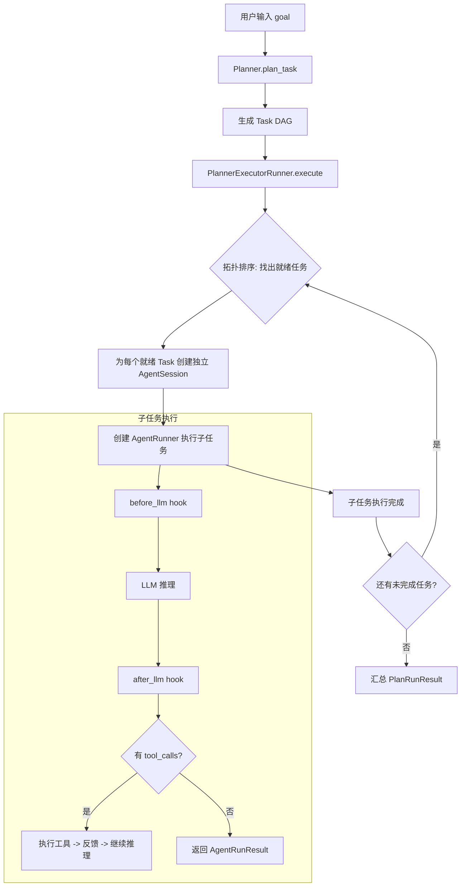
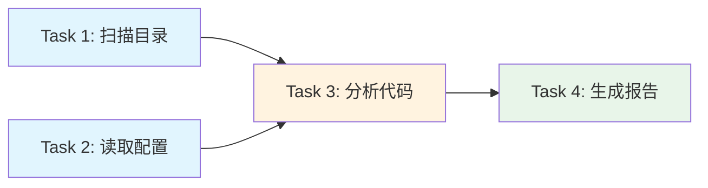
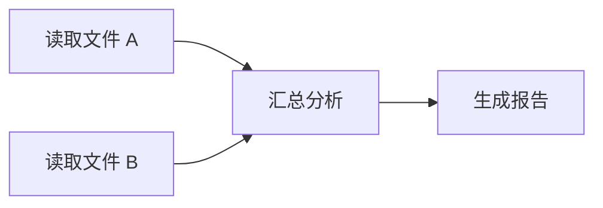
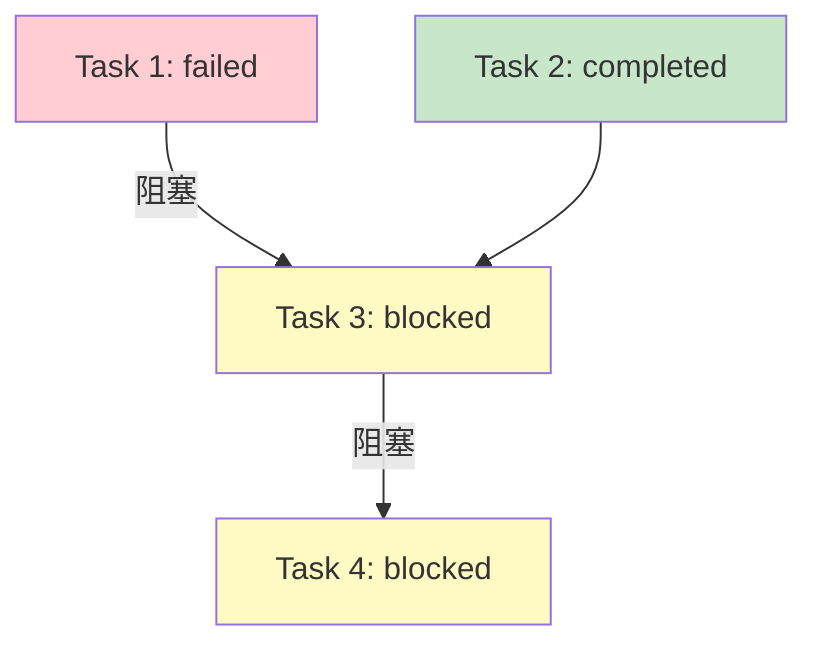

# PlanAgent

`PlanAgent` 是 Wuwei 框架中的规划型 Agent，用于将复杂任务拆解为多个子任务并按依赖关系协调执行。它在 `AgentRunner` 之上增加了 Planner 层，通过 `PlannerExecutorRunner` 编排任务 DAG 的执行。

## 与 Agent 的对比

| 特性 | Agent (AgentRunner) | PlanAgent (PlannerExecutorRunner) |
|---|---|---|
| 执行方式 | 单轮对话式，自主工具调用 | 先规划，再按 DAG 分步执行 |
| 适用场景 | 简单问答、单步任务 | 复杂多步骤、可分解的任务 |
| 工具调用 | Agent 自主决定调用什么工具 | Planner 分配任务，每个子任务独立执行 |
| 任务隔离 | 无（共享同一 session context） | 每个子任务拥有独立的 `AgentSession` |
| 可观测性 | `text_delta`、`tool_start` 等事件 | 额外支持 `on_task_start`、`on_task_end` Hook |
| 依赖管理 | 无 | 支持 DAG 依赖和并行执行 |
| 返回值 | `AgentRunResult` | `PlanRunResult`（含任务列表和分阶段统计） |
| 失败处理 | 异常向上抛出 | 失败任务阻塞下游，标记为 `blocked` |

## 核心架构



## 创建 PlanAgent

### 从环境变量创建（推荐）

```python
from wuwei import PlanAgent

agent = PlanAgent.from_env()
```

`from_env()` 接受与 `Agent.from_env()` 相同的环境变量和参数（`session`、`hooks`、`tools`）。

### 手动创建

```python
from wuwei import PlanAgent
from wuwei.llm import OpenAILLM
from wuwei.runtime.planner_executor_runner import PlannerExecutorRunner
from wuwei.planning import Planner

llm = OpenAILLM(api_key="sk-xxx", model="gpt-4o")

agent = PlanAgent(
    model=llm,
    planner=Planner.create_planner(llm=llm),  # 默认 Planner
    tools=[...],
    system_prompt="你是一个任务规划和执行助手。",
)
```

## 三种使用模式

### 模式一：非流式执行（`run()`）

规划并执行，等待全部完成后返回 `PlanRunResult`：

```python
result = agent.run("帮我分析 src/ 目录下所有 Python 文件的代码质量并生成报告")

print(f"总 Token: {result.usage['total_tokens']}")
print(f"总耗时: {result.latency_ms}ms")
print(f"LLM 调用: {result.llm_calls} 次")

for task in result.tasks:
    print(f"\n[Task {task.id}] {task.description}")
    print(f"  状态: {task.status}")
    print(f"  结果: {(task.result or '')[:100]}")
```

### 模式二：流式执行（`stream()`）

按任务顺序流式输出每个子任务的 token：

```python
async for chunk in agent.stream("调研并对比 3 个 Python Web 框架"):
    if chunk.content:
        print(chunk.content, end="", flush=True)
```

### 模式三：事件流执行（`event_stream()`）

获取包含规划过程的完整结构化事件流：

```python
async for event in agent.event_stream("重构项目结构"):
    match event.type:
        case "text_delta":
            print(event.data["content"], end="", flush=True)
        case "tool_start":
            task_id = event.data.get("task_id", "?")
            print(f"\n  [Task {task_id}] 工具: {event.data['tool_name']}")
        case "tool_end":
            print(f"  结果: {event.data['output'][:100]}")
        case "done":
            task_id = event.data.get("task_id")
            if task_id:
                print(f"\n  [Task {task_id}] 完成")
            else:
                print(f"\n全部完成")
        case "error":
            task_id = event.data.get("task_id")
            print(f"\n  [Task {task_id or '?'}] 错误: {event.data['message']}")
```

#### 事件流中的额外字段

在 `PlanAgent` 的事件流中，每个事件的 `data` 字典会额外包含：

| 字段 | 类型 | 说明 |
|---|---|---|
| `task_id` | `int` | 当前子任务 ID |
| `task_description` | `str` | 当前子任务描述 |
| `root_session_id` | `str` | 根 session ID（父级） |

## PlanRunResult

`run()` 的返回值，包含任务 DAG 的完整执行结果：

| 字段 | 类型 | 说明 |
|---|---|---|
| `tasks` | `list[Task]` | 所有子任务及其状态 |
| `usage` | `dict[str, int]` | 总 token 使用量（规划 + 执行） |
| `latency_ms` | `int` | 总耗时（毫秒） |
| `llm_calls` | `int` | 总 LLM 调用次数（规划 + 执行） |
| `planner_usage` | `dict[str, int]` | **规划阶段** token 使用量 |
| `planner_latency_ms` | `int` | 规划阶段耗时 |
| `planner_llm_calls` | `int` | 规划阶段 LLM 调用次数 |
| `execution_usage` | `dict[str, int]` | **执行阶段** token 使用量 |
| `execution_latency_ms` | `int` | 执行阶段耗时 |
| `execution_llm_calls` | `int` | 执行阶段 LLM 调用次数 |

### Task 对象

| 字段 | 类型 | 说明 |
|---|---|---|
| `id` | `int` | 任务 ID |
| `description` | `str` | 任务描述 |
| `result` | `str \| None` | 执行结果（完成后填充） |
| `status` | `str` | 状态：`pending`、`in_progress`、`completed`、`failed`、`blocked` |
| `error` | `str \| None` | 错误信息（失败/阻塞时填充） |
| `next` | `list[int]` | 下游任务 ID 列表 |

### 使用 PlanRunResult 的完整示例

```python
result = agent.run("调研并对比 3 个 Python Web 框架")

print("=" * 50)
print("规划阶段")
print(f"  Token: {result.planner_usage['total_tokens']}")
print(f"  耗时: {result.planner_latency_ms}ms")
print(f"  LLM 调用: {result.planner_llm_calls} 次")

print("\n执行阶段")
print(f"  Token: {result.execution_usage['total_tokens']}")
print(f"  耗时: {result.execution_latency_ms}ms")
print(f"  LLM 调用: {result.execution_llm_calls} 次")

print(f"\n总计: {result.usage['total_tokens']} tokens, {result.latency_ms}ms")

print(f"\n任务列表 ({len(result.tasks)} 个):")
for task in result.tasks:
    icon = {"completed": "✓", "failed": "✗", "blocked": "⊘"}.get(task.status, "?")
    print(f"  {icon} [{task.id}] {task.description}")
    if task.error:
        print(f"    错误: {task.error}")
```

## DAG 执行原理

Planner 生成的任务形成一个有向无环图（DAG），`PlannerExecutorRunner` 按拓扑顺序执行：



- **蓝色**（T1、T2）：无依赖，第一轮并行执行
- **橙色**（T3）：依赖 T1、T2 完成后执行
- **绿色**（T4）：依赖 T3 完成后执行

### 执行流程

```python
# PlannerExecutorRunner 内部执行逻辑：
# 1. 调用 planner.plan_task(goal) 生成 Task 列表
# 2. 建立依赖索引（_index_tasks）
# 3. 循环：
#    a. 标记被失败上游阻塞的任务（_mark_blocked_tasks）
#    b. 找出所有就绪任务（所有依赖已完成）（_get_ready_tasks）
#    c. 对就绪任务创建独立 AgentSession 并执行
#    d. 重复直到没有就绪任务
# 4. 标记残留未完成任务为 blocked（_mark_unresolved_tasks）
```

## 任务隔离

每个子任务在独立的 `AgentSession` 中执行，互不干扰：

```python
# PlannerExecutorRunner._create_task_session 内部实现：
task_session = AgentSession(
    session_id=f"{parent_session.session_id}:task:{task_id}",
    system_prompt=parent_session.system_prompt,
    max_steps=parent_session.max_steps,
    parallel_tool_calls=parent_session.parallel_tool_calls,
)
```

这意味着：
- 子任务 A 调用工具产生的中间结果**不会**污染子任务 B 的上下文
- 每个子任务有独立的 `max_steps` 限制
- 上游任务的结果会通过 prompt 注入到下游任务的输入中

### 上游结果传递

依赖任务完成后，其结果会作为上下文注入到下游任务的 prompt 中：

```python
# PlannerExecutorRunner._build_prompt 构造的 prompt 结构：
"""
# 角色
你是一个任务执行代理，只负责执行当前分配给你的单个任务。

# 总目标
{goal}

# 当前任务
当前任务 ID: {task.id}
当前任务描述: {task.description}

# 上下文
已完成上游任务结果:
Task 1
描述: ...
结果: ...

Task 2
描述: ...
结果: ...

# 执行规则
1. 只执行当前任务，不要改写任务图
2. 优先复用已完成的上游任务结果
...
"""
```

!!! tip "提示"
    任务隔离确保每个子任务拥有干净的上下文窗口，避免长对话导致的 context window 溢出问题。上游结果通过 prompt 注入而非共享 context 来传递，既保证了隔离性又保留了信息流。

## 自定义 Planner

通过实现 `BasePlanner` 接口来自定义规划逻辑：

```python
from wuwei.planning import Planner

class ResearchPlanner(Planner):
    """针对调研任务优化的 Planner"""

    async def plan_task(self, goal: str) -> list[Task]:
        # 返回 Task 列表，通过 next 定义依赖关系
        return [
            Task(id=1, description="搜索相关资料", next=[2]),
            Task(id=2, description="整理要点", next=[3]),
            Task(id=3, description="生成报告", next=[]),
        ]
```

### Task 依赖定义

任务依赖通过 `Task.next` 字段声明（指向下游任务 ID），框架自动转换为依赖关系并按拓扑排序执行：

```python
# 定义：T1 -> T3, T2 -> T3, T3 -> T4
tasks = [
    Task(id=1, description="读取文件 A", next=[3]),
    Task(id=2, description="读取文件 B", next=[3]),
    Task(id=3, description="汇总分析", next=[4]),
    Task(id=4, description="生成报告", next=[]),
]

# 执行顺序：
# 第 1 轮: T1, T2（并行，无依赖）
# 第 2 轮: T3（等待 T1, T2 完成）
# 第 3 轮: T4（等待 T3 完成）
```



!!! warning "注意"
    - 自定义 Planner 返回的 Task 描述应当清晰明确，Agent 会直接使用这些描述作为指令来执行。
    - Task.id 必须唯一，否则会抛出 `ValueError`。
    - Task.next 中引用的 ID 必须存在于列表中，否则会抛出 `ValueError`。

## 错误处理与失败阻塞

### 子任务失败

子任务执行异常时，状态标记为 `failed`，不影响其他独立任务：

```python
tasks = [
    Task(id=1, description="可能失败的任务", next=[3]),
    Task(id=2, description="独立任务", next=[3]),
    Task(id=3, description="汇总", next=[]),
]

result = agent.run("执行以上任务")
# 如果 Task 1 失败：
#   Task 1: status="failed", error="..."
#   Task 2: status="completed"（不受影响）
#   Task 3: status="blocked"（被 Task 1 阻塞）
```

### 阻塞传播

当上游任务失败或被阻塞时，所有下游任务自动标记为 `blocked`：



### Task 状态说明

| 状态 | 说明 |
|---|---|
| `pending` | 等待执行（依赖未满足） |
| `in_progress` | 正在执行 |
| `completed` | 执行成功，`result` 包含输出 |
| `failed` | 执行失败，`error` 包含错误信息 |
| `blocked` | 被失败/阻塞的上游任务阻塞 |

### 错误事件

在事件流模式中，失败的子任务会产生 `error` 事件：

```python
async for event in agent.event_stream("复杂任务"):
    if event.type == "error":
        task_id = event.data.get("task_id")
        task_desc = event.data.get("task_description", "")
        error_msg = event.data.get("message", "")
        print(f"[Task {task_id}] {task_desc} 失败: {error_msg}")
```

## PlanAgent 的 Hook 集成

`PlannerExecutorRunner` 支持两个额外的 Hook 回调：

| Hook 方法 | 触发时机 |
|---|---|
| `on_task_start(session, task)` | 子任务开始执行前 |
| `on_task_end(session, task)` | 子任务执行完成后（无论成功或失败） |

```python
from wuwei.runtime.hooks import RuntimeHook

class TaskMonitorHook(RuntimeHook):
    async def on_task_start(self, session, task):
        print(f"▶ 开始: Task {task.id} - {task.description}")

    async def on_task_end(self, session, task):
        icon = "✓" if task.status == "completed" else "✗"
        print(f"{icon} 结束: Task {task.id} - {task.status}")

agent = PlanAgent.from_env(hooks=[TaskMonitorHook()])
```

## 完整示例

```python
import asyncio
from wuwei import PlanAgent
from wuwei.runtime.hooks import RuntimeHook
from wuwei.runtime.console_hook import ConsoleHook

class ProgressHook(RuntimeHook):
    """自定义 Hook：显示任务进度"""
    def __init__(self):
        self.total = 0
        self.completed = 0

    async def on_task_start(self, session, task):
        self.total += 1

    async def on_task_end(self, session, task):
        if task.status in ("completed", "failed", "blocked"):
            self.completed += 1
        print(f"进度: {self.completed}/{self.total}")

async def main():
    agent = PlanAgent.from_env(
        hooks=[ConsoleHook(), ProgressHook()],
    )

    # 事件流方式执行复杂任务
    async for event in agent.event_stream(
        "分析当前项目的代码结构，找出潜在的安全问题，并生成修复建议"
    ):
        match event.type:
            case "text_delta":
                print(event.data["content"], end="", flush=True)
            case "tool_start":
                task_id = event.data.get("task_id", "?")
                print(f"\n  [Task {task_id}] ⚙ {event.data['tool_name']}")
            case "tool_end":
                print(f"  [Task {event.data.get('task_id')}] 结果: {event.data['output'][:80]}")
            case "done":
                task_id = event.data.get("task_id")
                if task_id:
                    print(f"\n  [Task {task_id}] ✓ 完成")
                else:
                    usage = event.data["usage"]
                    print(f"\n{'='*50}")
                    print(f"全部完成 | Token: {usage['total_tokens']} | 耗时: {event.data['latency_ms']}ms")
            case "error":
                task_id = event.data.get("task_id")
                print(f"\n  [Task {task_id or '?'}] ✗ {event.data['message']}")

    # 非流式方式查看详细统计
    result = agent.run("分析并重构 utils/ 模块")
    print(f"\n规划阶段: {result.planner_usage['total_tokens']} tokens, {result.planner_llm_calls} 次 LLM 调用")
    print(f"执行阶段: {result.execution_usage['total_tokens']} tokens, {result.execution_llm_calls} 次 LLM 调用")

    for task in result.tasks:
        status_icon = {"completed": "✓", "failed": "✗", "blocked": "⊘"}.get(task.status, "?")
        print(f"  {status_icon} Task {task.id}: {task.description}")
        if task.error:
            print(f"    错误: {task.error}")

asyncio.run(main())
```
