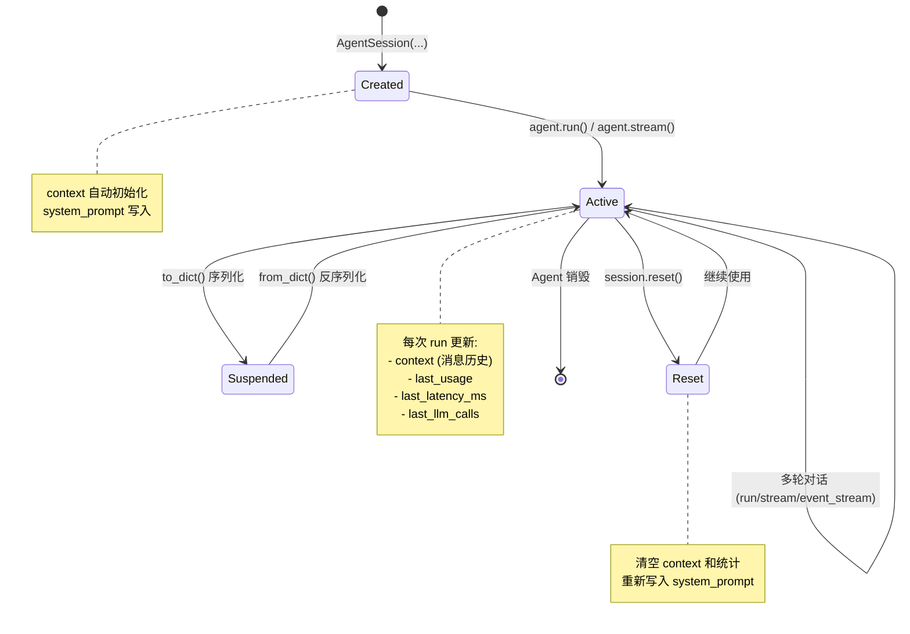

# AgentSession

`AgentSession` 是 Wuwei 框架中管理 Agent 对话状态的核心数据类，使用 Python `@dataclass` 实现。它持有消息上下文、会话配置和运行统计信息，是实现多轮对话、会话持久化和会话复用的基础组件。

## 数据结构

```python
from dataclasses import dataclass, field

@dataclass
class AgentSession:
    session_id: str
    system_prompt: str = "你是一个有用的助手"
    max_steps: int = 10
    parallel_tool_calls: bool = False
    summary: str | None = None
    metadata: dict[str, Any] = field(default_factory=dict)
    last_usage: dict[str, int] = field(default_factory=lambda: {
        "prompt_tokens": 0, "completion_tokens": 0, "total_tokens": 0,
    })
    last_latency_ms: int = 0
    last_llm_calls: int = 0
    context: Context  # 自动生成，不可通过 __init__ 传入
```

### 字段详解

| 字段 | 类型 | 说明 | 默认值 |
|---|---|---|---|
| `session_id` | `str` | 会话唯一标识符 | **必填** |
| `system_prompt` | `str` | 系统提示词，初始化时写入 context | `"你是一个有用的助手"` |
| `max_steps` | `int` | 最大推理步骤数（含工具调用轮次） | `10` |
| `parallel_tool_calls` | `bool` | 是否并行执行多个工具调用 | `False` |
| `summary` | `str \| None` | 上下文压缩生成的摘要 | `None` |
| `metadata` | `dict[str, Any]` | 自定义元数据，不影响对话逻辑 | `{}` |
| `last_usage` | `dict[str, int]` | 最近一次 run 的 token 使用量 | 全零 |
| `last_latency_ms` | `int` | 最近一次 run 的耗时（毫秒） | `0` |
| `last_llm_calls` | `int` | 最近一次 run 的 LLM 调用次数 | `0` |
| `context` | `Context` | 消息上下文管理器（`__post_init__` 自动生成） | — |

!!! info "context 字段"
    `context` 字段通过 `__post_init__` 自动初始化，**不在构造函数参数中暴露**。它会自动创建并写入 `system_prompt`。调用 `reset()` 会重新生成 context。

### `last_usage` 字典结构

| 键 | 类型 | 说明 |
|---|---|---|
| `prompt_tokens` | `int` | 输入 token 数 |
| `completion_tokens` | `int` | 输出 token 数 |
| `total_tokens` | `int` | 总 token 数 |

## 创建 Session

### 方式一：自动创建（默认）

Agent 默认会自动创建 session，无需手动管理：

```python
from wuwei import Agent

agent = Agent.from_env()
result = agent.run("你好")
# agent.session 已自动生成，session_id 为自动生成的 UUID
```

### 方式二：手动创建后传入 Agent

需要自定义配置时手动创建 session：

```python
from wuwei import Agent
from wuwei.agent.session import AgentSession

session = AgentSession(
    session_id="my-session-001",
    system_prompt="You are a Python expert.",
    max_steps=20,
    parallel_tool_calls=True,
    metadata={"user_id": "u_12345", "project": "my-app"},
)

agent = Agent.from_env(session=session)
```

### 方式三：从字典反序列化

从持久化存储中恢复 session：

```python
import json
from wuwei.agent.session import AgentSession

# 从 JSON 文件恢复
with open("session_backup.json") as f:
    data = json.load(f)

session = AgentSession.from_dict(data)
agent = Agent.from_env(session=session)
```

## Session 生命周期



## 属性访问

```python
session = agent.session

# 基本信息
session.session_id        # str - 会话 ID
session.system_prompt     # str - 系统提示词
session.max_steps         # int - 最大步骤数
session.metadata          # dict - 自定义元数据

# 运行统计（最近一次 run）
session.last_usage        # dict - token 使用量
session.last_latency_ms   # int - 耗时（毫秒）
session.last_llm_calls    # int - LLM 调用次数

# 上下文
session.context           # Context - 消息上下文
session.context.get_messages()  # list[Message] - 所有消息
session.summary           # str | None - 压缩摘要
```

## 元数据（Metadata）

元数据是附着在 session 上的键值对，不影响对话逻辑，可用于业务关联、状态追踪等：

```python
session = AgentSession(
    session_id="support-001",
    metadata={
        "user_id": "u_12345",
        "conversation_id": "conv_abc",
        "source": "web",
        "tags": ["support", "billing"],
        "priority": "normal",
    },
)

# 后续可随时读取和更新
session.metadata["priority"] = "high"
session.metadata["assigned_agent"] = "gpt-4o"
```

### Metadata 使用模式

```python
# 模式 1：Hook 中使用 metadata 传递状态
class MyHook(RuntimeHook):
    async def before_tool(self, session, tool_call, *, step, task=None):
        # 用 metadata 做跨 hook 的状态传递
        session.metadata[f"tool_{step}_start"] = time.monotonic()

    async def after_tool(self, session, tool_call, tool_message, *, step, task=None):
        start = session.metadata.get(f"tool_{step}_start")
        elapsed = time.monotonic() - start
        session.metadata[f"tool_{step}_elapsed"] = elapsed

# 模式 2：业务关联
session.metadata["tenant_id"] = "org_abc"
session.metadata["feature_flags"] = {"new_ui": True}

# 模式 3：PlanAgent 中 task 隔离 session 也会继承 metadata
# 参见 plan-agent.md
```

## 序列化

Session 支持与 `dict` 的互转，方便持久化存储：

### `to_dict()`

将 session 完整序列化为字典，包含 context 中的所有消息：

```python
data = session.to_dict()
# 返回结构：
# {
#     "session_id": "my-session-001",
#     "system_prompt": "You are a Python expert.",
#     "max_steps": 20,
#     "parallel_tool_calls": True,
#     "summary": None,
#     "metadata": {"user_id": "u_12345"},
#     "last_usage": {"prompt_tokens": 1523, ...},
#     "last_latency_ms": 2340,
#     "last_llm_calls": 3,
#     "context": {"messages": [...]},
# }
```

### `from_dict(data)`

从字典恢复 session（类方法）：

```python
restored = AgentSession.from_dict(data)
agent = Agent.from_env(session=restored)
# 完整的消息历史、配置和统计信息均已恢复
```

### 持久化示例

```python
import json
import redis

r = redis.Redis()

def save_session(session: AgentSession):
    """保存到 Redis"""
    data = session.to_dict()
    r.set(f"session:{session.session_id}", json.dumps(data))
    r.expire(f"session:{session.session_id}", 86400)  # 24h 过期

def load_session(session_id: str) -> AgentSession:
    """从 Redis 恢复"""
    raw = r.get(f"session:{session_id}")
    if raw is None:
        raise KeyError(f"Session {session_id} not found")
    return AgentSession.from_dict(json.loads(raw))

# 使用
session = AgentSession(session_id="user-123", metadata={"user_id": "u_123"})
agent = Agent.from_env(session=session)
agent.run("你好")
save_session(session)

# 后续恢复
restored = load_session("user-123")
agent2 = Agent.from_env(session=restored)
agent2.run("继续之前的对话")
```

## 统计信息

每次 `run()` / `stream()` / `event_stream()` 执行后，session 的统计字段会自动更新：

```python
agent.run("帮我分析这个文件")
print(f"Token: {session.last_usage['total_tokens']}")  # 1523
print(f"耗时: {session.last_latency_ms}ms")              # 2340
print(f"LLM 调用: {session.last_llm_calls} 次")         # 3

agent.run("再看看另一个文件")
# 统计被更新为最新一次 run 的值（不是累计值）
print(f"Token: {session.last_usage['total_tokens']}")  # 892（新值，非累计）
```

!!! warning "注意"
    `last_usage`、`last_latency_ms`、`last_llm_calls` 记录的是**最近一次 run** 的统计，不是累计值。如需累计统计，请自行在应用层累加或使用 Hook 记录。

## 重置 Session

当需要重置对话但保留 session 配置时：

```python
session.reset()
# 效果：
# 1. context 被重新创建（清空所有消息历史）
# 2. system_prompt 重新写入 context
# 3. last_usage 重置为全零
# 4. last_latency_ms 和 last_llm_calls 重置为 0
# 5. metadata 和 session_id 保留不变
```

!!! warning "注意"
    `reset()` 不可逆，消息历史将丢失。如需保留，请先调用 `session.to_dict()` 备份。

## 会话复用

将 session 传给新的 Agent 实例即可恢复对话上下文：

```python
# 第一轮对话
agent1 = Agent.from_env()
result1 = agent1.run("我叫小明，我在学 Python")
session = agent1.session

# 第二轮：复用 session
agent2 = Agent.from_env(session=session)
result2 = agent2.run("你还记得我叫什么吗？")
print(result2.content)  # "你叫小明。"
```

### 多 Agent 协作中的 session 传递

```python
# 场景：代码分析 Agent 完成后，将上下文传递给报告 Agent
analysis_agent = Agent.from_env(
    session=AgentSession(
        session_id="analysis-001",
        system_prompt="你是一个代码分析专家。",
    )
)
analysis_result = analysis_agent.run("分析 src/ 目录的代码结构")
session = analysis_agent.session

# 传递给报告 Agent
report_agent = Agent.from_env(session=session)
# report_agent 可以访问 analysis_agent 的完整对话历史
report = report_agent.run("基于上面的分析结果，生成一份 Markdown 报告")
```

## PlanAgent 中的 Session 隔离

在 `PlanAgent` 中，每个子任务会创建独立的 session 副本：

```python
# PlanAgent 内部会为每个 task 创建隔离 session：
task_session = AgentSession(
    session_id=f"{parent_session.session_id}:task:{task_id}",
    system_prompt=parent_session.system_prompt,
    max_steps=parent_session.max_steps,
    parallel_tool_calls=parent_session.parallel_tool_calls,
)
```

这意味着子任务之间的消息历史互不干扰，但共享相同的系统提示词和配置。

## 完整示例

```python
import asyncio
import json
from wuwei import Agent
from wuwei.agent.session import AgentSession

async def main():
    # 创建带元数据的 session
    session = AgentSession(
        session_id="demo-full",
        system_prompt="你是一个友好的编程助手。",
        max_steps=20,
        parallel_tool_calls=True,
        metadata={"project": "my-api", "version": "1.0"},
    )

    agent = Agent.from_env(session=session)

    # 多轮对话
    r1 = agent.run("我在写一个 FastAPI 项目")
    print(f"[轮次 1] {r1.content[:100]}")

    r2 = agent.run("帮我写一个健康检查接口")
    print(f"[轮次 2] {r2.content[:100]}")

    # 查看统计
    usage = session.last_usage
    print(f"\n统计:")
    print(f"  Token: {usage['total_tokens']}")
    print(f"  耗时: {session.last_latency_ms}ms")
    print(f"  LLM 调用: {session.last_llm_calls} 次")

    # 持久化
    data = session.to_dict()
    with open("session_backup.json", "w") as f:
        json.dump(data, f, ensure_ascii=False, indent=2)
    print(f"\nSession 已保存到 session_backup.json")

    # 恢复
    with open("session_backup.json") as f:
        restored = AgentSession.from_dict(json.load(f))
    print(f"Session 已恢复: {restored.session_id}")
    print(f"消息数: {len(restored.context.get_messages())}")

asyncio.run(main())
```
