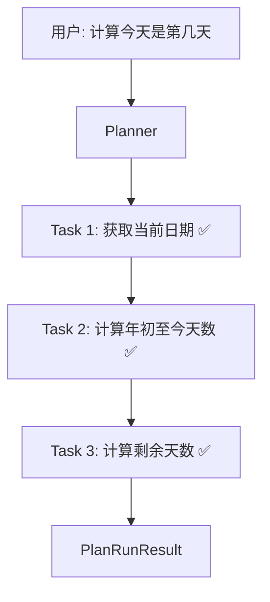

# PlanAgent 示例

使用 Plan-and-Execute 模式处理复杂多步任务。

## 基础用法

```python
import asyncio
from wuwei import PlanAgent

async def main():
    # 创建 PlanAgent（内置规划器自动创建）
    agent = PlanAgent.from_env(
        builtin_tools=["time", "calc"],
        system_prompt="你是一个任务规划助手。",
    )

    # 运行：先规划，再执行
    result = await agent.run("计算今天是今年的第几天，然后算出剩余天数")

    # 查看任务详情
    print("=== 任务列表 ===")
    for task in result.tasks:
        print(f"  [{task.status}] Task {task.id}: {task.description}")
        if task.result:
            print(f"        结果: {task.result[:100]}...")

    # 查看执行统计
    print(f"\n=== 统计 ===")
    print(f"总耗时: {result.latency_ms}ms")
    print(f"规划耗时: {result.planner_latency_ms}ms")
    print(f"执行耗时: {result.execution_latency_ms}ms")
    print(f"总 LLM 调用: {result.llm_calls}")

asyncio.run(main())
```

## 执行流程



## 分步调用

```python
async def main():
    agent = PlanAgent.from_env(builtin_tools=["file", "calc"])

    # 只规划，不执行
    tasks = await agent.plan("读取 data.csv，计算每列平均值，生成报告")
    print(f"规划了 {len(tasks)} 个任务")
    for t in tasks:
        print(f"  Task {t.id}: {t.description} → next={t.next}")

    # 可以修改任务后再执行
    # tasks[0].description = "改为读取 data2.csv"

    result = await agent.execute(
        "读取 data.csv，计算每列平均值，生成报告",
        tasks,
    )
```

## 流式事件

```python
async def main():
    agent = PlanAgent.from_env(builtin_tools=["time", "calc"])

    async for event in agent.stream_events("计算明天是星期几"):
        if event.type == "text_delta":
            print(event.data["content"], end="", flush=True)
        elif event.type == "tool_start":
            print(f"\n🔧 调用工具: {event.data['tool_name']}")
        elif event.type == "tool_end":
            print(f"   结果: {str(event.data['output'])[:80]}")
        elif event.type == "done":
            print(f"\n✅ 完成")

asyncio.run(main())
```

## 带 HITL 的 PlanAgent

```python
import asyncio
from wuwei import PlanAgent
from wuwei.runtime import HitlHook, ApprovalPolicy, ConsoleApprovalProvider

async def main():
    hitl = HitlHook(
        provider=ConsoleApprovalProvider(),
        policy=ApprovalPolicy(
            require_approval_tools={"git_commit", "delete_file"},
        ),
    )

    agent = PlanAgent.from_env(
        builtin_tools=["file", "git"],
        hooks=[hitl],
    )

    # 写文件会自动执行，git commit 需要人工确认
    result = await agent.run("修改 README.md 并提交")

    for task in result.tasks:
        print(f"[{task.status}] {task.description}")

asyncio.run(main())
```

## 带持久化和压缩

```python
import asyncio
from wuwei import PlanAgent, LLMGateway
from wuwei.runtime import StorageHook, ContextCompressionHook
from wuwei.memory import FileStorage, LLMContextCompressor

async def main():
    llm = LLMGateway.from_env()

    agent = PlanAgent.from_env(
        builtin_tools=["file", "calc"],
        hooks=[
            StorageHook(FileStorage("./sessions")),
            ContextCompressionHook(
                compressor=LLMContextCompressor(llm),
                compress_after_turns=20,
                keep_recent_turns=5,
            ),
        ],
    )

    result = await agent.run("分析项目中所有 Python 文件的代码行数")

asyncio.run(main())
```

## 任务状态说明

| 状态 | 含义 |
|------|------|
| `pending` | 等待执行 |
| `in_progress` | 正在执行 |
| `completed` | 执行成功 |
| `failed` | 执行失败 |
| `blocked` | 被失败的上游任务阻塞 |
