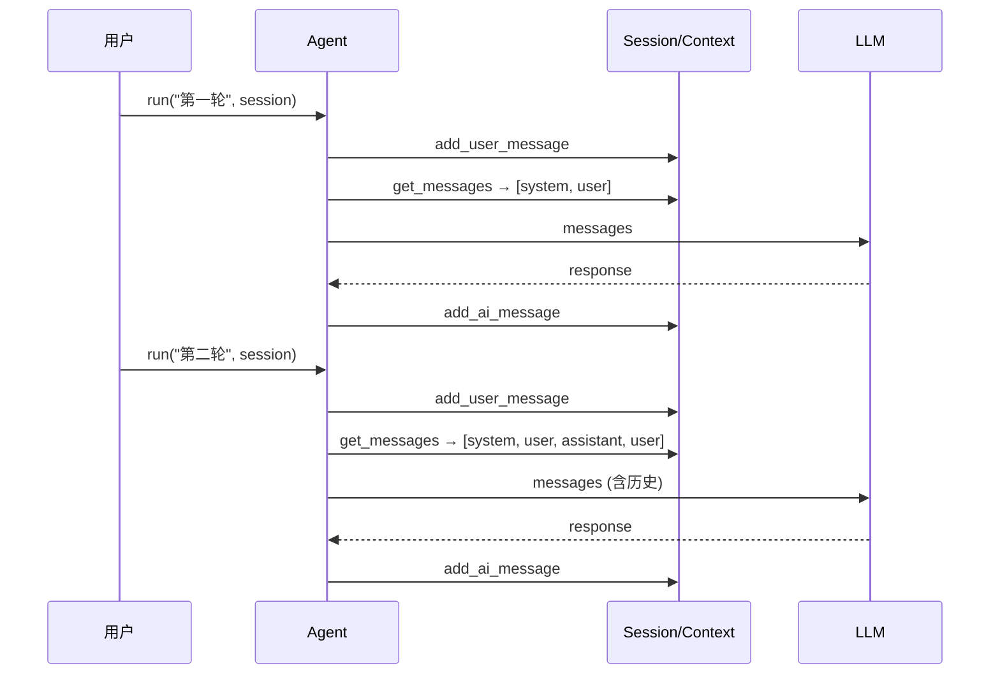

# 多轮会话示例

使用 `AgentSession` 管理多轮对话上下文。

## 基础多轮对话

```python
import asyncio
from wuwei import Agent

async def main():
    agent = Agent.from_env(builtin_tools=["time", "calc"])

    # 创建会话
    session = agent.create_session(system_prompt="你是一个数学助手")

    # 第一轮
    r1 = await agent.run("帮我计算 2 的 10 次方", session=session)
    print(f"第 1 轮: {r1.content}")

    # 第二轮 —— 上下文自动保持
    r2 = await agent.run("再加上 100 呢？", session=session)
    print(f"第 2 轮: {r2.content}")

    # 第三轮
    r3 = await agent.run("刚才的结果乘以 3", session=session)
    print(f"第 3 轮: {r3.content}")

asyncio.run(main())
```

## 会话复用

通过 `session_id` 复用已有会话：

```python
async def main():
    agent = Agent.from_env()

    # 首次调用，创建会话
    r1 = await agent.run("我叫小明", session_id="user-123")
    print(r1.content)

    # 再次调用，自动复用同一会话
    r2 = await agent.run("我叫什么名字？", session_id="user-123")
    print(r2.content)  # Agent 应该记得"小明"
```

## 会话持久化

使用 `StorageHook` + `FileStorage` 自动持久化：

```python
import asyncio
from wuwei import Agent
from wuwei.runtime import StorageHook
from wuwei.memory import FileStorage

async def main():
    storage = FileStorage("./sessions")
    agent = Agent.from_env(
        builtin_tools=["time"],
        hooks=[StorageHook(storage)],
    )

    # 运行并自动保存
    result = await agent.run("你好", session_id="my-session")
    print(result.content)

    # 之后可以从存储加载
    session = await storage.load("my-session")
    if session:
        print(f"会话 {session.session_id} 有 {len(session.context.get_messages())} 条消息")

asyncio.run(main())
```

## 多用户场景

```python
async def handle_user(user_id: str, message: str):
    """每个用户独立会话。"""
    agent = Agent.from_env(builtin_tools=["time", "calc"])

    # 按 user_id 隔离会话
    result = await agent.run(message, session_id=f"user-{user_id}")
    return result.content

# 不同用户互不干扰
r1 = await handle_user("alice", "我叫 Alice")
r2 = await handle_user("bob", "我叫 Bob")
r3 = await handle_user("alice", "我叫什么？")  # 应该记得 Alice
```

## 关键点

- `AgentSession` 自动维护对话历史（通过内部 `Context`）
- 每次 `agent.run()` 会把历史消息一起发送给 LLM
- 使用 `ContextCompressionHook` 可自动压缩过长的历史
- `session.reset()` 清空会话上下文


