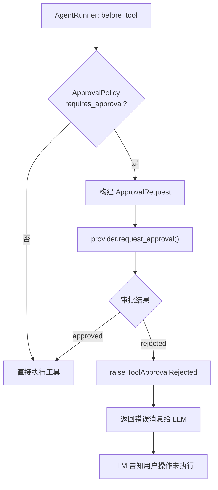

# HITL — 人机协作

HITL（Human-In-The-Loop）机制允许在工具调用前插入人工审批环节，防止 Agent 自动执行敏感操作。

## 核心组件

### ApprovalProvider

审批提供者协议：

```python
class ApprovalProvider(Protocol):
    async def request_approval(self, request: ApprovalRequest) -> ApprovalDecision
```

### ApprovalRequest

```python
@dataclass
class ApprovalRequest:
    id: str                                    # 唯一请求 ID
    session_id: str                            # 会话 ID
    action_type: str                           # 操作类型（如 "tool_call"）
    payload: dict[str, Any]                    # 操作详情（tool_name, arguments 等）
    tool_call: ToolCall | None = None          # 原始 ToolCall
    metadata: dict[str, Any] = field(default_factory=dict)
```

### ApprovalDecision

```python
@dataclass
class ApprovalDecision:
    status: Literal["approved", "rejected", "pending"]
    reason: str | None = None
    metadata: dict[str, Any] = field(default_factory=dict)
```

### ApprovalPolicy

基于工具名称的审批策略：

```python
class ApprovalPolicy:
    def __init__(
        self,
        *,
        require_approval_tools: set[str] | None = None,
        auto_approve_tools: set[str] | None = None,
    )
    def requires_tool_approval(self, tool_call, *, session, task=None) -> bool
```

| 参数 | 说明 |
|------|------|
| `require_approval_tools` | 需要审批的工具名称集合 |
| `auto_approve_tools` | 自动批准的工具名称集合 |

判断逻辑：
1. 在 `auto_approve_tools` 中 → 不需要审批
2. 在 `require_approval_tools` 中 → 需要审批
3. 都不在 → 不需要审批（默认放行）

### ConsoleApprovalProvider

开发环境下的控制台审批实现：

```python
class ConsoleApprovalProvider:
    async def request_approval(self, request: ApprovalRequest) -> ApprovalDecision
```

在终端打印操作详情，等待用户输入 `y` 确认或其它拒绝。

### ToolApprovalRejected

审批拒绝时抛出的异常：

```python
class ToolApprovalRejected(Exception)
```

AgentRunner 捕获此异常后，将错误信息返回给 LLM 而非中断运行。

## 审批流程



## 集成方式

```python
from wuwei import Agent
from wuwei.runtime import HitlHook, ApprovalPolicy, ConsoleApprovalProvider

hitl_hook = HitlHook(
    provider=ConsoleApprovalProvider(),
    policy=ApprovalPolicy(
        require_approval_tools={"git_commit", "npm_install_package", "delete_file"},
        auto_approve_tools={"read_text_file", "get_now"},
    ),
)

agent = Agent.from_env(
    builtin_tools=["time", "file", "git"],
    hooks=[hitl_hook],
)

# 运行时，git_commit 等操作会等待人工确认
result = await agent.run("帮我提交代码")
```

## HitlHook 工作原理

`HitlHook` 是一个 `RuntimeHook`，在 `before_tool` 阶段拦截：

```python
class HitlHook(RuntimeHook):
    def __init__(self, provider: ApprovalProvider, policy: ApprovalPolicy | None = None)

    async def before_tool(self, session, tool_call, *, step, task=None):
        if not self.policy.requires_tool_approval(tool_call, session=session, task=task):
            return  # 不需要审批，放行

        request = ApprovalRequest(...)
        decision = await self.provider.request_approval(request)
        if decision.status != "approved":
            raise ToolApprovalRejected(decision.reason)
```

## 自定义审批后端

实现 `ApprovalProvider` 协议即可对接任意审批系统：

```python
class WebUIApprovalProvider:
    def __init__(self, websocket):
        self.ws = websocket

    async def request_approval(self, request):
        await self.ws.send_json({
            "type": "approval_request",
            "id": request.id,
            "tool": request.payload.get("tool_name"),
            "args": request.payload.get("arguments"),
        })
        response = await self.ws.receive_json()
        return ApprovalDecision(
            status="approved" if response.get("approved") else "rejected",
            reason=response.get("reason"),
        )
```

## 多 Hook 组合

HITL 可与其它 Hook 组合使用：

```python
agent = Agent.from_env(
    builtin_tools=["time", "file", "git", "python"],
    hooks=[
        HitlHook(provider=ConsoleApprovalProvider(), policy=...),
        StorageHook(FileStorage("./sessions")),
        ConsoleHook(),  # 调试日志
    ],
)
```

Hook 按注册顺序执行，`before_tool` 中 HITL 如果拒绝，后续 Hook 不会被调用。
