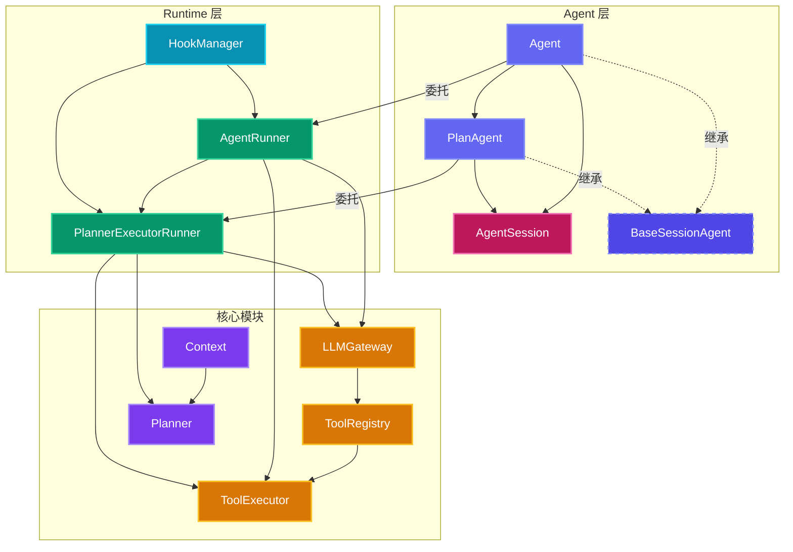
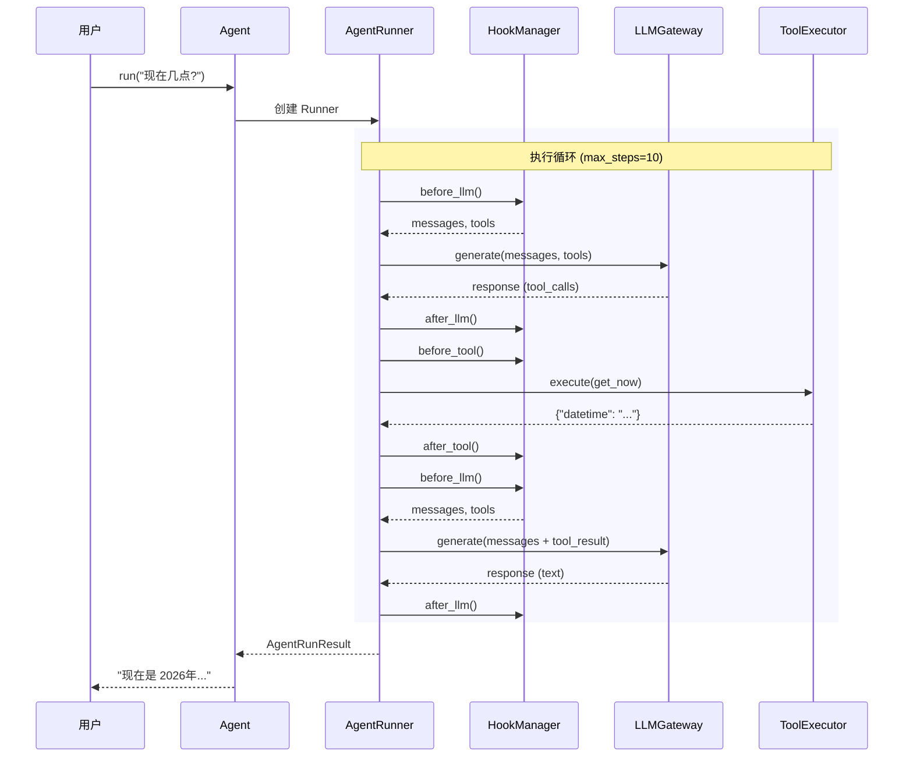

---
hide:
  - navigation
  - toc
---

<div class="hero-section">
  <span class="hero-badge">v0.1.8 · Python ≥ 3.10 · Apache-2.0</span>
  <h1>Wuwei</h1>
  <p class="hero-subtitle">
    无为而治的 AI Agent 框架<br>
    轻量、可扩展、模块化的 Python 智能体开发框架
  </p>
  <div class="hero-buttons">
    <a href="getting-started/quickstart/" class="btn-primary">
      快速开始 →
    </a>
    <a href="https://github.com/xiaojiaenen/wuwei" class="btn-secondary">
      :fontawesome-brands-github: GitHub
    </a>
  </div>
</div>

<div class="stats-row">
  <div class="stat-item">
    <div class="stat-number">7</div>
    <div class="stat-label">核心模块</div>
  </div>
  <div class="stat-item">
    <div class="stat-number">7</div>
    <div class="stat-label">内置工具</div>
  </div>
  <div class="stat-item">
    <div class="stat-number">5</div>
    <div class="stat-label">生命周期 Hook</div>
  </div>
  <div class="stat-item">
    <div class="stat-number">4</div>
    <div class="stat-label">依赖包</div>
  </div>
</div>

---

<div class="feature-grid">
  <div class="feature-card card-purple">
    <span class="feature-icon">🧩</span>
    <h3>模块化架构</h3>
    <p>Agent、Runtime、Planning、Tools、LLM 各层边界清晰，职责分明。每层只依赖下层接口，不跨层调用，易于理解和扩展。</p>
  </div>
  <div class="feature-card card-cyan">
    <span class="feature-icon">🔌</span>
    <h3>Hook 系统</h3>
    <p>可插拔的生命周期钩子，支持上下文压缩、持久化、审批拦截等任意扩展。新增功能无需修改核心代码。</p>
  </div>
  <div class="feature-card card-emerald">
    <span class="feature-icon">📋</span>
    <h3>Plan & Execute</h3>
    <p>内置 DAG 任务规划器，自动拆解复杂目标为任务图，按依赖顺序执行，支持失败阻塞和任务隔离。</p>
  </div>
  <div class="feature-card card-rose">
    <span class="feature-icon">🛡️</span>
    <h3>HITL 审批</h3>
    <p>Human-in-the-Loop 机制，关键操作需人工确认。支持控制台、Web、IM 等多种审批后端。</p>
  </div>
  <div class="feature-card card-amber">
    <span class="feature-icon">🔧</span>
    <h3>工具系统</h3>
    <p>支持装饰器注册、自动从函数签名生成 JSON Schema。内置文件、Git、时间、计算等 7 个常用工具。</p>
  </div>
  <div class="feature-card card-orange">
    <span class="feature-icon">🧠</span>
    <h3>记忆管理</h3>
    <p>上下文滑动窗口、LLM 滚动摘要压缩、持久化存储。长对话不丢失关键信息，自动管理上下文长度。</p>
  </div>
</div>

---

## 5 分钟快速上手

<div class="step-grid">
  <div class="step-card">
    <div class="step-number">1</div>
    <h4>安装</h4>
    <p><code>pip install wuwei</code></p>
  </div>
  <div class="step-card">
    <div class="step-number">2</div>
    <h4>配置</h4>
    <p>设置 <code>OPENAI_API_KEY</code> 环境变量</p>
  </div>
  <div class="step-card">
    <div class="step-number">3</div>
    <h4>编写</h4>
    <p>创建 Agent 并注册工具</p>
  </div>
  <div class="step-card">
    <div class="step-number">4</div>
    <h4>运行</h4>
    <p>调用 <code>agent.run()</code> 开始对话</p>
  </div>
</div>

```python title="hello.py"
import asyncio
from wuwei import Agent

async def main():
    agent = Agent.from_env(
        builtin_tools=["time"],
        system_prompt="你是一个有用的助手",
    )
    result = await agent.run("现在几点？")
    print(result.content)

asyncio.run(main())
```

---

## 技术栈

<div class="tech-row">
  <span class="tech-badge">🐍 Python 3.10+</span>
  <span class="tech-badge">🤖 OpenAI 兼容协议</span>
  <span class="tech-badge">📐 Pydantic v2</span>
  <span class="tech-badge">⚡ 异步优先</span>
  <span class="tech-badge">📦 轻量依赖</span>
</div>

---

## 架构一览



---

## 执行流程



---

<div class="section-divider"><span>Wuwei</span></div>

<div style="text-align: center; padding: 2rem 0 4rem; color: #52525b;">
  <p style="font-size: 1.1rem; margin-bottom: 0.5rem;">以无为之道，治智能之体</p>
  <p style="font-size: 0.85rem;">Wuwei Agent Framework &copy; 2026 xiaojiaenen</p>
</div>
