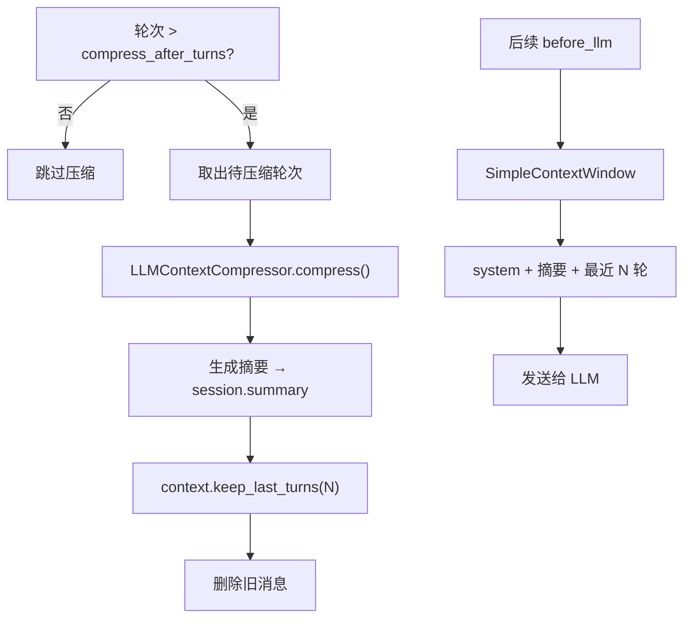

# ContextCompressor — 上下文压缩

当对话轮次过多时，压缩器将旧消息摘要化，保留关键信息同时减少 token 消耗。

## 协议

```python
class ContextCompressor(Protocol):
    async def compress(
        self,
        *,
        previous_summary: str | None,
        messages: list[Message],
    ) -> str:
        """把一段旧消息压缩成可延续任务的摘要。"""
        ...
```

任何实现此协议的类均可作为压缩器。

## LLMContextCompressor

基于 LLM 的压缩器实现：

```python
class LLMContextCompressor:
    def __init__(self, llm: LLMGateway, system_prompt: str | None = None)
    async def compress(self, *, previous_summary, messages) -> str
```

### 构造参数

| 参数 | 说明 | 默认值 |
|------|------|--------|
| `llm` | LLM 网关实例 | — |
| `system_prompt` | 压缩专用 system prompt | 内置中文提示 |

### 压缩提示词

压缩器要求 LLM 保留以下信息：

- 用户目标
- 已确认事实和约束
- 用户偏好
- 已执行工具及关键结果
- 当前进度
- 待办事项
- 风险和阻塞

如果存在 `previous_summary`，会在 prompt 中提供以便增量压缩。

## 压缩流程



### 关键步骤

1. **触发条件**：轮次数量超过 `compress_after_turns`（默认 30）
2. **增量压缩**：传入 `previous_summary`，LLM 在已有摘要基础上更新
3. **消息裁剪**：调用 `context.keep_last_turns(keep_recent_turns)` 删除旧消息
4. **窗口构建**：后续每次 `before_llm` 通过 `SimpleContextWindow` 注入摘要

## 集成方式

通过 `ContextCompressionHook` 自动集成：

```python
from wuwei import Agent, LLMGateway
from wuwei.runtime import ContextCompressionHook
from wuwei.memory import LLMContextCompressor

llm = LLMGateway.from_env()

hook = ContextCompressionHook(
    compressor=LLMContextCompressor(llm),
    compress_after_turns=30,   # 30 轮后触发压缩
    keep_recent_turns=10,      # 保留最近 10 轮
)

agent = Agent.from_env(hooks=[hook])
```

## 自定义压缩器

实现 `ContextCompressor` 协议即可替换：

```python
class MyCompressor:
    async def compress(self, *, previous_summary, messages):
        # 自定义压缩逻辑
        return "自定义摘要..."

hook = ContextCompressionHook(compressor=MyCompressor())
```
