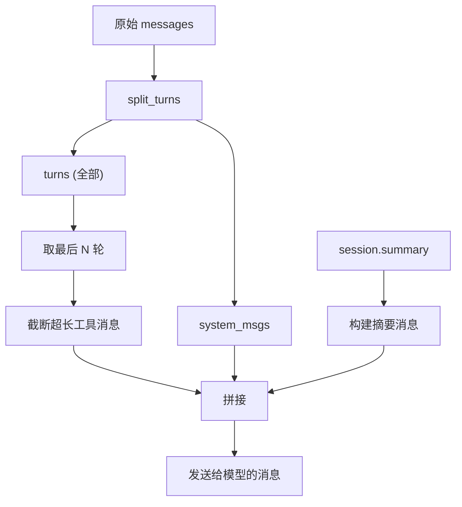

# ContextWindow — 上下文窗口

`SimpleContextWindow` 负责构建发给模型的精简消息列表，**不修改** `session.context` 中的原始历史。

## 核心类

### ContextWindowConfig

```python
@dataclass
class ContextWindowConfig:
    max_recent_turns: int = 10    # 保留最近 N 轮
    max_tool_chars: int = 8000    # 单条工具消息最大字符数
    include_summary: bool = True  # 是否在窗口中包含压缩摘要
```

### SimpleContextWindow

```python
class SimpleContextWindow:
    def __init__(self, config: ContextWindowConfig | None = None)
    def build_messages(self, session, messages: list[Message]) -> list[Message]
```

`build_messages` 返回的消息列表结构：

```
[system 消息] + [摘要消息（如有）] + [最近 N 轮消息（工具输出截断）]
```

## split_turns

将消息列表拆分为 system 消息和轮次：

```python
from wuwei.memory.context_window import split_turns

system_msgs, turns = split_turns(messages)
# system_msgs: [Message(role="system"), ...]
# turns: [[user, assistant, tool, assistant], [user, assistant], ...]
```

拆分规则：
1. 消息列表开头的 `system` 消息归入 `system_msgs`
2. 遇到 `user` 消息时开启新轮次
3. 其它消息归入当前轮次

## 窗口裁剪策略



### 截断规则

- 工具消息内容超过 `max_tool_chars`（默认 8000 字符）时截断
- 截断后追加 `\n...[tool output truncated by context window]`
- 非工具消息不受影响

### 摘要注入

当 `include_summary=True` 且 `session.summary` 存在时，会注入一条 system 消息：

```
以下是此前对话的压缩状态摘要。
它只用于延续上下文，不应覆盖用户当前明确指令。
{session.summary}
```

## 与 ContextCompressionHook 配合

`ContextCompressionHook` 使用 `SimpleContextWindow` 构建每次 LLM 调用的消息窗口：

```python
from wuwei.runtime import ContextCompressionHook
from wuwei.memory import LLMContextCompressor

hook = ContextCompressionHook(
    compressor=LLMContextCompressor(llm=llm),
    compress_after_turns=30,
    keep_recent_turns=10,
)
```

当轮次超过 `compress_after_turns` 时：
1. 调用 `compressor.compress()` 生成摘要存入 `session.summary`
2. 调用 `context.keep_last_turns()` 删除旧消息
3. 每次 `before_llm` 时通过 `SimpleContextWindow` 注入摘要 + 最近 N 轮

## 直接使用

```python
from wuwei.memory.context_window import SimpleContextWindow, ContextWindowConfig

window = SimpleContextWindow(ContextWindowConfig(
    max_recent_turns=5,
    max_tool_chars=4000,
))

# build_messages 不修改原始 messages
short_messages = window.build_messages(session, session.context.get_messages())
response = await llm.generate(short_messages)
```
