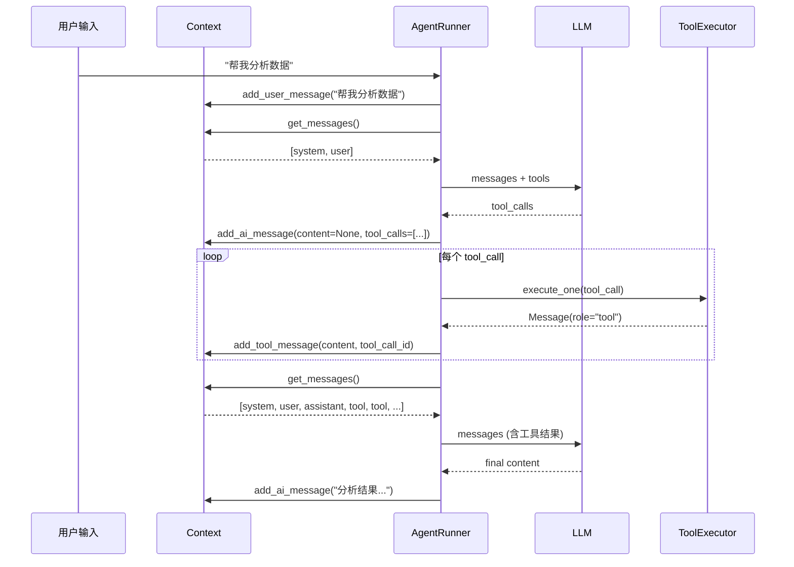

# Context — 消息上下文

`Context` 是维护单个会话消息历史的核心类。它只负责消息的增删查，不涉及窗口裁剪或持久化。

## 类定义

```python
class Context:
    """维护单个会话的消息历史。"""

    def __init__(self) -> None
```

内部存储 `list[Message]`，所有操作均围绕这个列表展开。

## 方法一览

| 方法 | 签名 | 说明 |
|------|------|------|
| `add_system_message` | `(content: str) -> None` | 追加 system 消息 |
| `add_user_message` | `(content: str) -> None` | 追加 user 消息 |
| `add_ai_message` | `(content, tool_calls, reasoning_content) -> Message` | 追加 assistant 消息，返回该消息 |
| `add_tool_message` | `(content: str, tool_call_id: str \| None) -> None` | 追加工具返回消息 |
| `get_messages` | `() -> list[Message]` | 返回完整消息列表 |
| `get_last_message` | `() -> Message \| None` | 返回最后一条消息 |
| `reset` | `() -> None` | 清空所有消息 |
| `keep_last_turns` | `(n: int) -> None` | 保留 system 消息 + 最近 n 轮对话 |
| `to_dict` | `() -> dict` | 序列化为 dict |
| `from_dict` | `(data: dict) -> Context` | 从 dict 反序列化（类方法） |

## 消息类型

`Message` 是 Pydantic 模型：

```python
class Message(BaseModel):
    role: Literal["system", "user", "assistant", "tool"]
    content: str | None = None
    reasoning_content: str | None = None     # 思考链内容
    tool_calls: list[ToolCall] | None = None  # 工具调用列表
    tool_call_id: str | None = None           # 工具返回时的关联 ID
```

## 消息流转



## keep_last_turns

当对话轮次过多时，可裁剪旧消息以节省内存：

```python
context.keep_last_turns(5)  # 保留 system + 最近 5 轮
```

> :bulb: 这个方法会直接修改内存中的消息列表。如果需要发送给模型的短窗口，请使用 [SimpleContextWindow](context-window.md)。

## 序列化

```python
# 导出
data = context.to_dict()
# {"messages": [{"role": "system", "content": "..."}, ...]}

# 恢复
ctx = Context.from_dict(data)
```

## 与 AgentSession 的关系

`AgentSession` 持有一个 `Context` 实例：

```python
session = AgentSession(session_id="abc")
session.context.add_user_message("hello")
```

`session.reset()` 会重新创建空 `Context` 并写入 `system_prompt`。
