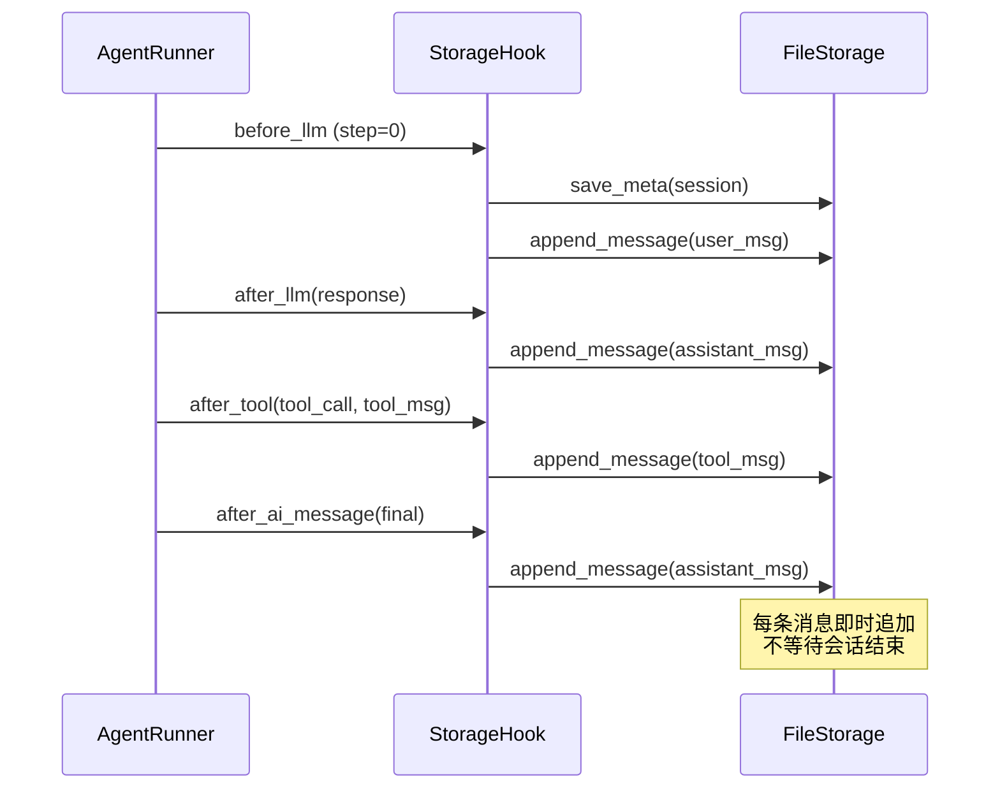

# Storage — 持久化存储

Storage 负责将会话数据持久化到外部存储系统。

## 协议

```python
class Storage(Protocol):
    """持久化存储协议。消息增量追加，元数据覆盖保存。"""

    async def save_meta(self, session: AgentSession) -> None
    async def append_message(self, session_id: str, message: Message) -> None
    async def load(self, session_id: str) -> AgentSession | None
    async def delete(self, session_id: str) -> None
```

| 方法 | 说明 |
|------|------|
| `save_meta` | 保存会话元数据（配置、摘要、统计等），不含消息 |
| `append_message` | 增量追加单条消息 |
| `load` | 加载完整会话（元数据 + 全部消息） |
| `delete` | 删除会话的所有数据 |

## FileStorage

内置的文件存储实现，使用 JSON 格式。

```python
class FileStorage:
    def __init__(self, root: str | Path = ".wuwei_sessions")
```

### 存储结构

每个会话产生两个文件：

```
.wuwei_sessions/
├── {session_id}.meta.json    # 元数据
└── {session_id}.jsonl        # 消息（每行一条）
```

### meta.json 格式

```json
{
  "session_id": "abc123",
  "system_prompt": "你是一个有用的助手",
  "max_steps": 10,
  "parallel_tool_calls": false,
  "summary": null,
  "metadata": {},
  "last_usage": {"prompt_tokens": 0, "completion_tokens": 0, "total_tokens": 0},
  "last_latency_ms": 0,
  "last_llm_calls": 0
}
```

### jsonl 格式

每行一条 JSON 序列化的 `Message`：

```jsonl
{"role":"system","content":"你是一个有用的助手"}
{"role":"user","content":"帮我分析数据"}
{"role":"assistant","content":null,"tool_calls":[{"id":"call_1","type":"function","function":{"name":"read_file","arguments":{"path":"data.csv"}}}]}
{"role":"tool","content":"...","tool_call_id":"call_1"}
{"role":"assistant","content":"数据包含 1000 行..."}
```

### 写入安全

`save_meta` 使用 **原子写入** 策略：
1. 写入 `.tmp` 临时文件
2. `os.replace()` 原子替换目标文件

防止写入中断导致文件损坏。

## 集成方式

通过 `StorageHook` 自动集成：

```python
from wuwei import Agent
from wuwei.runtime import StorageHook
from wuwei.memory import FileStorage

storage = FileStorage("./sessions")
hook = StorageHook(storage)

agent = Agent.from_env(hooks=[hook])
```

### StorageHook 行为

| 时机 | 动作 |
|------|------|
| `before_llm` (step=0) | `save_meta` + 追加 user 消息 |
| `after_llm` | 追加 assistant 消息；如有 summary 则更新 meta |
| `after_ai_message` | 追加 assistant 消息；如有 summary 则更新 meta |
| `after_tool` | 追加 tool 消息 |

## 持久化序列图



## 自定义 Storage

实现 `Storage` 协议即可对接任意后端：

```python
class RedisStorage:
    def __init__(self, redis_client):
        self.redis = redis_client

    async def save_meta(self, session):
        await self.redis.hset(f"session:{session.session_id}:meta", mapping={...})

    async def append_message(self, session_id, message):
        await self.redis.rpush(f"session:{session_id}:msgs", message.model_dump_json())

    async def load(self, session_id):
        ...

    async def delete(self, session_id):
        await self.redis.delete(f"session:{session_id}:meta", f"session:{session_id}:msgs")
```
