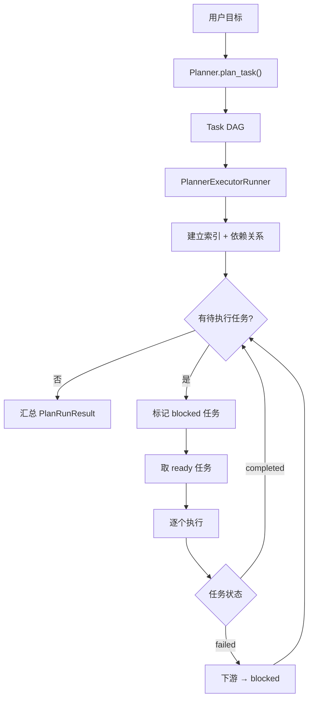

# 规划系统概览

Wuwei 的规划系统实现了 **Plan-and-Execute** 模式：先由 LLM 将复杂目标拆解为任务 DAG，再按依赖顺序逐个执行。

## 核心组件

### Planner

负责调用 LLM 生成任务计划。

```python
class Planner:
    def __init__(self, llm: LLMGateway)
    async def plan_task(self, goal: str) -> list[Task]
    @classmethod
    def create_planner(cls, llm: LLMGateway) -> Planner
```

| 属性 | 说明 |
|------|------|
| `last_usage` | 最近一次规划的 token 用量 |
| `last_latency_ms` | 最近一次规划的延迟 |
| `last_llm_calls` | 最近一次规划的 LLM 调用次数 |

### Task

单个规划任务节点：

```python
class Task(BaseModel):
    id: int                                    # 唯一 ID
    description: str                           # 任务描述
    next: list[int]                            # 下游任务 ID 列表
    status: Literal["pending", "in_progress", "completed", "failed", "blocked"]
    result: str | None = None                  # 执行结果
    error: str | None = None                   # 失败信息
```

### TaskList

```python
class TaskList(BaseModel):
    tasks: list[Task]
```

### PlanRunResult

一次 plan-and-execute 运行的汇总结果：

```python
class PlanRunResult(BaseModel):
    tasks: list[Task]                          # 任务列表（含最终状态）
    usage: dict[str, int]                      # 总 token 用量
    latency_ms: int                            # 总延迟
    llm_calls: int                             # 总 LLM 调用次数
    planner_usage: dict[str, int]              # 规划阶段用量
    planner_latency_ms: int                    # 规划阶段延迟
    planner_llm_calls: int                     # 规划阶段调用次数
    execution_usage: dict[str, int]            # 执行阶段用量
    execution_latency_ms: int                  # 执行阶段延迟
    execution_llm_calls: int                   # 执行阶段调用次数
```

## 规划提示词

`Planner` 使用结构化提示词要求 LLM 输出任务 DAG。关键规则：

1. 每个任务必须是独立、可执行、可验证的最小动作
2. 任务之间保持 DAG 结构，禁止循环依赖
3. `next` 表示当前任务完成后的下游任务
4. 只有一个起始任务，状态为 `in_progress`
5. 默认输出 2~5 个任务
6. 输出纯 JSON，无 Markdown

## 执行流程



## 使用方式

### 直接使用 PlanAgent

```python
from wuwei import PlanAgent

agent = PlanAgent.from_env(builtin_tools=["time", "calc"])
result = await agent.run("计算今天距离 2026 年元旦还有多少天")
```

### 分步调用

```python
agent = PlanAgent.from_env(builtin_tools=["file", "calc"])

# 只规划
tasks = await agent.plan("分析 sales.csv 并生成报告")

# 只执行（可修改 tasks 后再执行）
result = await agent.execute("分析 sales.csv 并生成报告", tasks)
```

### 流式事件

```python
async for event in agent.stream_events("分析数据"):
    if event.type == "text_delta":
        print(event.data["content"], end="")
    elif event.type == "tool_start":
        print(f"\n[调用工具] {event.data['tool_name']}")
```
