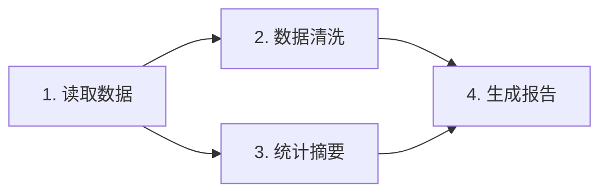
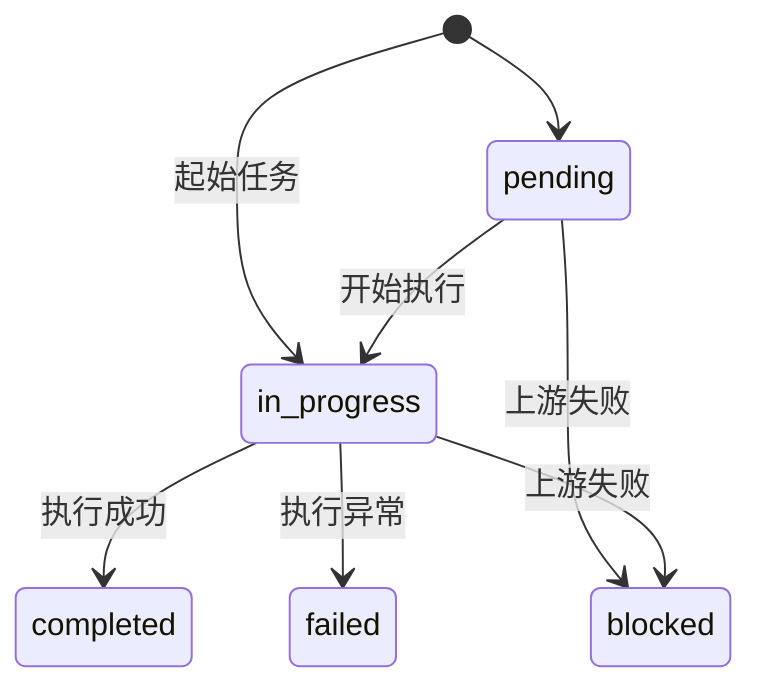
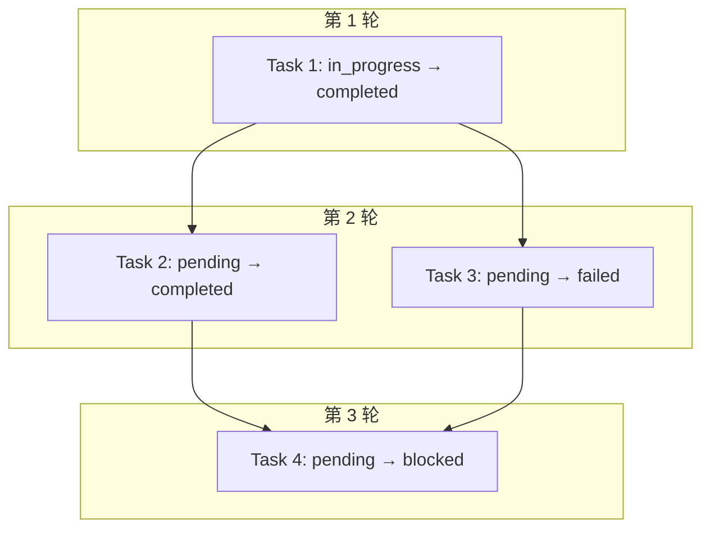

# 任务 DAG

Planner 输出的任务列表构成一个 **有向无环图（DAG）**，通过 `next` 字段定义依赖关系。

## DAG 结构

每个 `Task` 的 `next` 字段表示「当前任务完成后可以进入的下游任务 ID 列表」。框架在执行时会将其反转为依赖关系（即「谁依赖谁」）。

### 示例

```json
{
  "tasks": [
    {"id": 1, "description": "读取数据文件", "next": [2, 3], "status": "in_progress"},
    {"id": 2, "description": "数据清洗",     "next": [4],    "status": "pending"},
    {"id": 3, "description": "统计摘要",     "next": [4],    "status": "pending"},
    {"id": 4, "description": "生成报告",     "next": [],     "status": "pending"}
  ]
}
```

对应 DAG：



执行顺序：`1` → `2, 3`（可并行） → `4`

## 依赖解析

`PlannerExecutorRunner._index_tasks()` 将 `next` 反转为依赖列表：

```python
# next: {1: [2,3], 2: [4], 3: [4], 4: []}
# 翻转后 dependencies: {1: [], 2: [1], 3: [1], 4: [2,3]}
```

### Ready 判定

一个任务 `ready` 的条件：
- 状态为 `pending` 或 `in_progress`
- 所有上游依赖任务状态均为 `completed`

```python
def _get_ready_tasks(self, tasks_by_id, dependencies) -> list[Task]:
    ready = []
    for task in tasks_by_id.values():
        if task.status not in {"pending", "in_progress"}:
            continue
        parent_ids = dependencies[task.id]
        if all(tasks_by_id[pid].status == "completed" for pid in parent_ids):
            ready.append(task)
    return ready
```

## 失败与阻塞

### 任务失败

当任务执行抛出异常时：
- `task.status = "failed"`
- `task.error = str(exc)`

### 下游阻塞

任务失败后，所有直接或间接依赖它的任务会被标记为 `blocked`：

```python
def _mark_blocked_tasks(self, tasks_by_id, dependencies):
    for task in tasks_by_id.values():
        blocked_by = [
            pid for pid in dependencies[task.id]
            if tasks_by_id[pid].status in {"failed", "blocked"}
        ]
        if blocked_by:
            task.status = "blocked"
            task.error = f"Blocked by upstream tasks: {', '.join(map(str, blocked_by))}"
```

### 状态流转



## 任务隔离

每个任务在独立的 `AgentSession` 中执行：

```python
session_id = f"{root_session_id}:task:{task_id}"
```

- 共享同一个 `system_prompt`、`max_steps`、`parallel_tool_calls`
- 拥有独立的 `Context`（消息历史不共享）
- 上游任务结果通过 prompt 注入，而非共享上下文

## 并行执行

当前实现中，同一轮 `ready` 任务**顺序执行**（非真正并行）。未来可扩展为 `asyncio.gather` 并行执行无依赖的任务。

## 完整执行示例



结果：Task 4 因 Task 3 失败而被阻塞。
