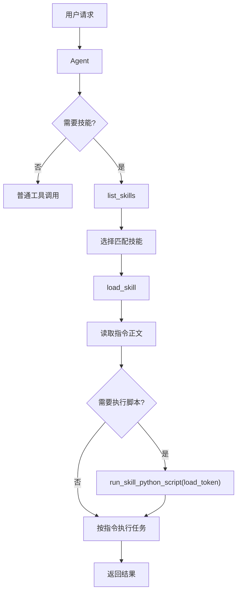

# 技能系统概览

技能（Skill）是可复用的领域专用指令集，通过 `SKILL.md` 文件定义。Agent 可以在运行时动态发现、加载和使用技能。

## 核心组件

### Skill

```python
@dataclass
class Skill:
    name: str              # 技能名称
    description: str       # 技能描述
    instruction: str       # 技能指令正文（Markdown）
    path: str | None = None # 技能目录路径
```

### SkillProvider

技能提供者协议：

```python
class SkillProvider(Protocol):
    def list_skills(self) -> list[Skill]
    def load_skill_instruction(self, skill_name: str) -> str | None
```

### SkillManager

技能管理器，聚合多个 `SkillProvider`：

```python
class SkillManager:
    def __init__(self, skill_providers: list[SkillProvider])
    def list_skills(self) -> list[Skill]
    def get_skill(self, skill_name: str) -> Skill
    def load_skill_instruction(self, skill_name: str) -> str | None
```

### FileSystemSkillProvider

从文件系统加载技能的默认实现：

```python
class FileSystemSkillProvider(SkillProvider):
    def __init__(self, skill_path: str)
```

自动递归扫描目录下所有 `SKILL.md` 文件。

## 三个内置工具

技能系统通过 `SkillHook` 自动注入三个工具：

| 工具 | 说明 |
|------|------|
| `list_skills` | 列出所有可用技能的摘要（名称、描述、是否含脚本） |
| `load_skill` | 加载指定技能的指令正文，返回 `load_token` |
| `run_skill_python_script` | 执行技能目录下 `scripts/` 中的 Python 脚本 |

> :warning: 调用 `run_skill_python_script` 前必须先调用 `load_skill` 获取 `load_token`，这是安全机制。

## 安全机制

1. **load_token 校验**：运行脚本前必须持有 `load_skill` 返回的 token
2. **路径限制**：脚本必须位于技能目录的 `scripts/` 子目录下
3. **文件类型**：只允许执行 `.py` 脚本
4. **超时控制**：脚本执行默认 10 秒超时
5. **输出限制**：stdout/stderr 最大 4000 字符

## 工作流程



## 集成方式

```python
from wuwei import Agent, SkillManager, FileSystemSkillProvider
from wuwei.runtime import SkillHook

# 创建技能管理器
provider = FileSystemSkillProvider("./skills")
manager = SkillManager([provider])

# 注入技能工具
from wuwei.tools import ToolRegistry

registry = ToolRegistry.from_builtin(["time", "file"])
from wuwei.tools.builtin.skill_tools import register_skill_tools
register_skill_tools(registry, manager)

# 创建带 SkillHook 的 Agent
agent = Agent.from_env(
    builtin_tools=["time", "file"],
    hooks=[SkillHook()],
)

# Agent 运行时会自动：
# 1. 在 system prompt 中注入技能使用说明
# 2. 注册 list_skills / load_skill / run_skill_python_script 工具
```

## 相关文档

- [技能编写指南](authoring.md) — SKILL.md 格式和目录结构
