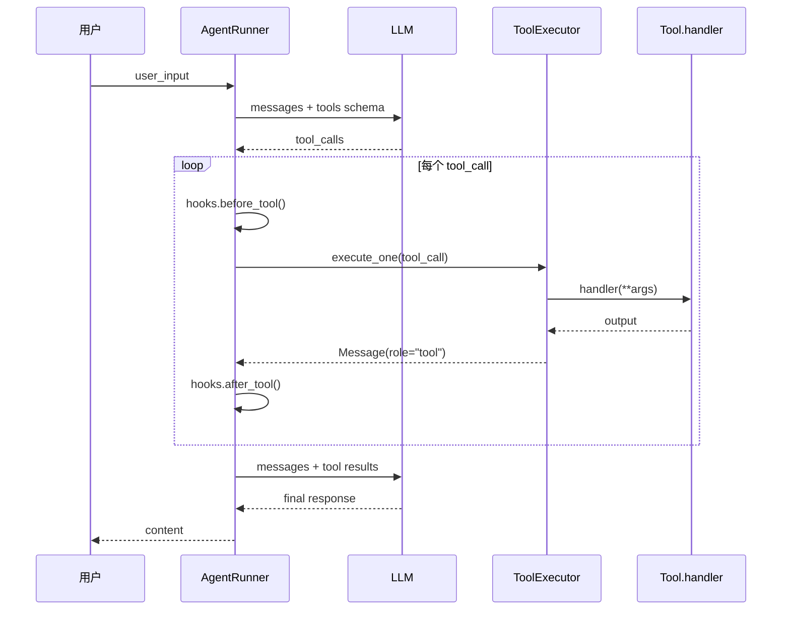

# 工具系统概览

Wuwei 的工具系统负责让 LLM 与外部世界交互。所有工具调用均经过 **注册 → 模型选择 → 执行 → 结果回传** 的统一流程。

## 核心模型

### Tool

```python
class Tool(BaseModel):
    name: str                                    # 工具名称
    description: str                             # 工具描述
    parameters: ToolParameters                   # 参数 JSON Schema
    handler: Callable[..., Any] | Callable[..., Awaitable[Any]]
```

- `handler` 同时支持同步和异步函数
- `invoke(args)` 内部自动检测协程并 `await`

### ToolParameters

```python
class ToolParameters(BaseModel):
    type: str = "object"
    properties: dict[str, Any] = Field(default_factory=dict)
    required: list = Field(default_factory=list)
```

`to_schema()` 输出标准的 OpenAI function calling JSON Schema。

### ToolRegistry

| 方法 | 说明 |
|------|------|
| `register(tool)` | 注册一个 `Tool` 实例 |
| `unregister(tool)` | 移除已注册工具 |
| `get(name)` | 按名称查找工具，返回 `Tool \| None` |
| `list_tools()` | 返回所有已注册工具列表 |
| `to_schema()` | 返回所有工具的 JSON Schema 列表 |
| `register_callable(func)` | 直接注册一个可调用对象 |
| `tool(name, description, parameters)` | **装饰器**，自动从签名生成 Schema |
| `from_builtin(names)` | 类方法，创建包含内置工具的注册表 |

### ToolExecutor

```python
class ToolExecutor:
    async def execute(tool_calls, concurrent=False) -> list[Message]
    async def execute_one(tool_call) -> Message
    def serialize_output(output) -> str
```

- `concurrent=True` 时使用 `asyncio.gather` 并行执行
- 输出自动序列化：`str` 直接返回，`BaseModel` 调用 `model_dump_json()`，其它使用 `json.dumps`
- 执行异常统一包装为 `{"ok": false, "error": {...}}` 格式

## 自动 Schema 生成

使用 `@registry.tool()` 装饰器时，框架会从函数签名自动生成 JSON Schema：

```python
registry = ToolRegistry()

@registry.tool(description="读取文件")
def read_file(path: str, max_chars: int = 1000) -> dict:
    ...
```

生成的 Schema 自动包含：
- 从类型注解推断参数类型（`str` → `string`，`int/float` → `number`，`bool` → `boolean`）
- 从 docstring `:param name:` 提取参数描述
- 无默认值参数自动加入 `required` 列表

## 工具调用流程



## 类型映射表

| Python 类型 | JSON Schema 类型 |
|-------------|-----------------|
| `str` | `string` |
| `int`, `float`, `complex` | `number` |
| `bool` | `boolean` |
| `list`, `tuple` | `array` |
| `dict` | `object` |
| 其它 | `string` |

## 相关文档

- [内置工具](builtin.md) — 7 个开箱即用的内置工具
- [自定义工具](custom.md) — 三种注册方式详解
